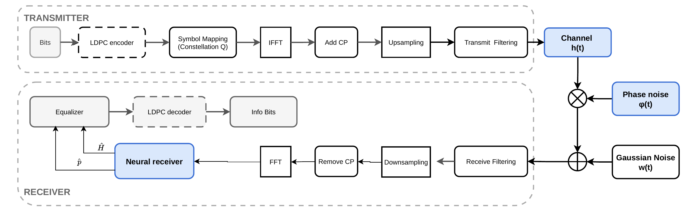
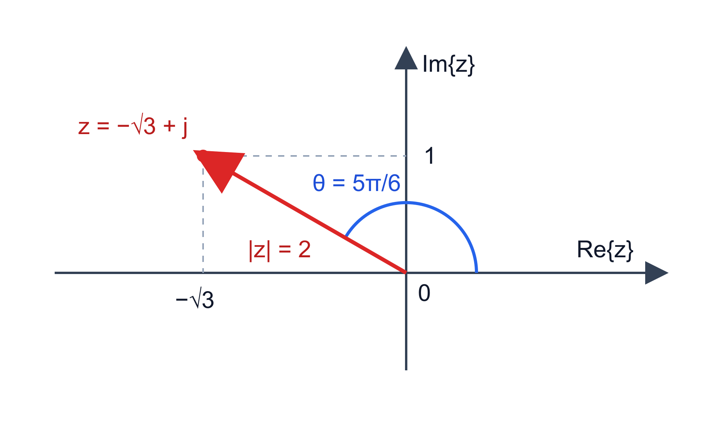

# ECE265 Tutorial 1

## Welcome to T02

Ruilin Wang · Thursday 13:00–13:50 · ELW B238

---

# Hi, I'm Ruilin Wang

- I am a PhD candidate supervised by Prof. Xiaodai Dong.
- My research applies neural networks to wireless communication systems.
- I was also a tutorial TA for ECE260 last term.

**My goal here:** help you understand *how to approach a problem*, not just see its final answer.

**Email:** ruilinwang@uvic.ca

---

# An example: Why Signals and Systems Matters to Me

## A sub-THz OFDM communication system



---

## Find the Course Concepts in This Diagram

**Signal (Textbook §1.2):** A function or sequence that carries information. Here: the transmitted OFDM waveform and received samples.

**System (Textbook §§1.3, 2.8):** Processes input signals into output signals. Here: the filters, channel model, and equalizer.

**ECE265 knowledge → modules in this project:**

- Complex numbers (Appendix A) → symbol mapping and phase noise.
- LTI systems and convolution (Chapters 4 and 9) → filters and channel model.
- Discrete Fourier transform (§10.6) → IFFT and FFT.
- Discrete-time transformations (§§8.2.3–8.2.4) → upsampling and downsampling.

---

# How T02 Tutorials Will Work

- We meet **face-to-face on Thursdays, 13:00–13:50, in ELW B238**.
- I will not take attendance. Come when a session is useful for you; plan around your own schedule.
- Before each tutorial, I will upload **two Markdown files** to this ECE265 tutorial GitHub repository.
- I will do my best to keep both files clear and approachable, including for students seeing a topic for the first time.

You remain responsible for official course announcements, deadlines, and requirements.

---

# Two Files Before Each Tutorial

## 1. Lecture Key Knowledge Summary

A short summary I prepare from the **lecture slides and textbook**.

It helps you locate definitions, connect ideas, and review quickly. **It is only a supplementary reference**; the instructor's materials take priority.

## 2. Tutorial Materials

The examples, explanations, and problem-solving routes we will use in the tutorial.

---

# What Will Tutorial Materials Focus On?

## Around assignments

We will work through **related practice examples**, the knowledge needed to start them, and the reasoning behind a solution method.

## Before exams

We will review **key concepts** and revisit representative examples connected to earlier assignments.

The aim is to help you solve new problems independently—not to replace your own assignment work.

---

# Questions Are Welcome

If any concept, slide, example, or assignment instruction is unclear, **please email me**:

## ruilinwang@uvic.ca

If possible, tell me the topic or page number and where you got stuck. That helps me prepare a useful explanation for you and, when appropriate, for the next tutorial.

---

# Assignment 1 Prep: Complex Numbers

We will use selected **textbook Appendix A exercises** to practise the methods needed for Assignment 1.

For each example: **knowledge to recall → solution route → answer**.

The official assignment sheet tells you which problems to submit.

---

## A.1(d): Polar → Cartesian

**Problem:** Convert the complex number $z=3e^{j\pi/2}$ to Cartesian form $a+jb$, where $a$ and $b$ are real numbers.

**Knowledge:** Euler's relation: $e^{j\theta}=\cos\theta+j\sin\theta$.

**Route:** Substitute $\theta=\pi/2$, then multiply both components by the magnitude $3$.

---

### A.1(d): Answer

Substitute $\theta=\pi/2$ into Euler's relation:

$$z=3e^{j\pi/2}=3\left[\cos\left(\frac{\pi}{2}\right)+j\sin\left(\frac{\pi}{2}\right)\right].$$

Since $\cos(\pi/2)=0$ and $\sin(\pi/2)=1$,

$$z=3(0+j\cdot1)=\boxed{0+3j=3j}.$$

---

## A.2(a): Cartesian → Polar

**Problem:** Write $z=-\sqrt{3}+j$ in polar form. Plot it on the complex plane, label its magnitude and angle, and state the principal argument.

**Knowledge:** $r=\sqrt{x^2+y^2}$; choose $\theta$ from the point's quadrant, not just $\arctan(y/x)$.

**Route:** Plot $(-\sqrt{3},1)$ in Quadrant II. Find $r$ and its reference angle.

---

### A.2(a): Answer - Magnitude

Here $x=-\sqrt3$ and $y=1$. The magnitude is

$$r=\sqrt{x^2+y^2}=\sqrt{(-\sqrt3)^2+1^2}=\sqrt{3+1}=2.$$

---

### A.2(a): Answer - Angle and Plot

The reference angle is $\arctan(1/\sqrt3)=\pi/6$. Since $x<0$ and $y>0$, the point is in Quadrant II, so $\theta=\pi-\pi/6=5\pi/6$.

$$\boxed{z=2e^{j5\pi/6}},\qquad \boxed{\mathrm{Arg}\,z=5\pi/6}.$$

Check: $2[\cos(5\pi/6)+j\sin(5\pi/6)]=2(-\sqrt3/2+j/2)=-\sqrt3+j$.

For the plot, draw an arrow from the origin to $(-\sqrt3,1)$ and label its length $2$.

---

### A.2(a): Answer - Plot



---

## A.3(c): Divide in Polar Form

**Problem:** Evaluate $\displaystyle\frac{\sqrt{3}/2-j/2}{1+j}$. Give the final result in polar form and state the principal value of its argument.

**Knowledge:** Because this is a quotient and the answer must be in polar form, first convert both numbers to exponential form $re^{j\theta}$. Then **divide magnitudes and subtract arguments**; this is much easier than expanding the fraction in Cartesian form.

**Route:** Numerator: $1e^{-j\pi/6}$. Denominator: $\sqrt{2}e^{j\pi/4}$.

---

### A.3(c): Answer - Convert Each Number

Numerator magnitude: $\sqrt{(\sqrt3/2)^2+(-1/2)^2}=\sqrt{3/4+1/4}=1$. Its angle is $-\pi/6$ because $\cos(-\pi/6)=\sqrt3/2$ and $\sin(-\pi/6)=-1/2$.

Denominator magnitude: $\sqrt{1^2+1^2}=\sqrt2$. Its angle is $\pi/4$ (Quadrant I).

---

### A.3(c): Answer - Divide

Divide magnitudes: $1/\sqrt2$. Subtract angles:

$$-\frac{\pi}{6}-\frac{\pi}{4}=-\frac{2\pi}{12}-\frac{3\pi}{12}=-\frac{5\pi}{12}.$$

$$z=\frac{1e^{-j\pi/6}}{\sqrt2e^{j\pi/4}}=\frac1{\sqrt2}e^{j(-\pi/6-\pi/4)}.$$

$$\boxed{z=\frac{1}{\sqrt2}e^{-j5\pi/12}}\quad\text{(principal angle).}$$

---

## A.3(f): Raise to a Power

**Problem:** Evaluate $(1+j)^{10}$ and express the final result in Cartesian form $a+jb$.

**Knowledge:** $\bigl(re^{j\theta}\bigr)^n=r^ne^{jn\theta}$.

**Route:** Write $1+j=\sqrt{2}e^{j\pi/4}$; raise the magnitude and angle to the 10th power.

---

### A.3(f): Answer

For $1+j$, the magnitude is $\sqrt{1^2+1^2}=\sqrt2$ and the angle is $\pi/4$. Thus $1+j=\sqrt2e^{j\pi/4}$.

$$ (1+j)^{10}=(\sqrt2)^{10}e^{j(10\pi/4)}=2^5e^{j5\pi/2}=32e^{j5\pi/2}. $$

Since $5\pi/2=2\pi+\pi/2$, the angle points straight up: $e^{j5\pi/2}=\cos(\pi/2)+j\sin(\pi/2)=j$.

$$\boxed{(1+j)^{10}=32j}.$$

---

## A.4(b): Argument of a Quotient

**Problem:** Prove that $\arg(z_1/z_2)=\arg z_1-\arg z_2$ (modulo $2\pi$). The quotient requires $z_2\ne0$; arguments also require $z_1\ne0$.

**Knowledge:** Arguments represent angles **modulo $2\pi$**. The principal argument must be brought back into its chosen interval.

**Route:** Let $z_k=r_ke^{j\theta_k}$, with $r_k>0$, and divide their polar forms.

---

### A.4(b): Answer

Write $z_1=r_1e^{j\theta_1}$ and $z_2=r_2e^{j\theta_2}$. Then

$$\frac{z_1}{z_2}=\frac{r_1e^{j\theta_1}}{r_2e^{j\theta_2}}=\frac{r_1}{r_2}e^{j(\theta_1-\theta_2)}.$$

So the quotient's angle is $\theta_1-\theta_2$:

$$\boxed{\arg(z_1/z_2)\equiv\arg z_1-\arg z_2\pmod{2\pi}}.$$

If using principal arguments, wrap the result into the principal interval. The argument of $0$ is undefined.

---

### A.4(b): Answer - Numerical Check

Take $z_1=1+j$ and $z_2=1-j$. Their angles are $\pi/4$ and $-\pi/4$.

Use $j^2=-1$ and multiply the quotient's top and bottom by $1+j$:

$$\frac{1+j}{1-j}=\frac{(1+j)^2}{(1-j)(1+j)}=\frac{1+2j+j^2}{1-j^2}=\frac{2j}{2}=j.$$

The left side has angle $\arg j=\pi/2$. The right side gives $\pi/4-(-\pi/4)=\pi/2$. They agree.

---

## A.4(e): Conjugate of a Product

**Problem:** For arbitrary complex numbers $z_1$ and $z_2$, prove that the conjugate of their product equals the product of their conjugates: $(z_1z_2)^*=z_1^*z_2^*$.

**Knowledge:** Conjugation reverses the sign of the polar angle: $(re^{j\theta})^*=re^{-j\theta}$.

**Route:** Write $z_1=r_1e^{j\theta_1}$ and $z_2=r_2e^{j\theta_2}$; conjugate the product.

---

### A.4(e): Answer

Multiply first, then conjugate (reverse the angle):

$$ (z_1z_2)^*=(r_1r_2e^{j(\theta_1+\theta_2)})^*=r_1r_2e^{-j(\theta_1+\theta_2)}. $$

Conjugate first, then multiply:

$$ z_1^*z_2^*=(r_1e^{-j\theta_1})(r_2e^{-j\theta_2})=r_1r_2e^{-j(\theta_1+\theta_2)}. $$

Both routes give the same result: $\boxed{(z_1z_2)^*=z_1^*z_2^*}$.

---

### A.4(e): Answer - Numerical Check

Take $z_1=1+j$ and $z_2=2-j$. Recall that $j^2=-1$; multiply first:

$$(1+j)(2-j)=2-j+2j-j^2=3+j,$$

so $(z_1z_2)^*=(3+j)^*=3-j$.

Now conjugate each number first: $z_1^*=1-j$, $z_2^*=2+j$.

$$z_1^*z_2^*=(1-j)(2+j)=2+j-2j-j^2=3-j.$$

Both calculations give $3-j$, as the general proof predicts.

---

## A.5(a): Magnitude and Phase of a Function

**Problem:** For the real variable $\omega$, let $\displaystyle f(\omega)=\frac{1}{(1+j\omega)^{10}}$. Find formulas for its magnitude $|f(\omega)|$ and argument $\arg f(\omega)$.

**Knowledge:** $|1+j\omega|=\sqrt{1+\omega^2}$ and $\arg(1+j\omega)=\arctan\omega$.

**Route:** Take the reciprocal to the 10th power: invert the magnitude and negate ten times the angle.

---

### A.5(a): Answer

First write the denominator's base in polar form:

$$1+j\omega=\sqrt{1+\omega^2}\,e^{j\arctan\omega}.$$

Raise it to the 10th power: $(1+j\omega)^{10}=(1+\omega^2)^5e^{j10\arctan\omega}$.

Taking the reciprocal changes the angle's sign:

$$f(\omega)=(1+\omega^2)^{-5}e^{-j10\arctan\omega}.$$

Therefore $\boxed{|f(\omega)|=(1+\omega^2)^{-5}}$ and $\boxed{\arg f(\omega)\equiv-10\arctan\omega\pmod{2\pi}}$.

---

### A.5(a): Answer - Numerical Check

Set $\omega=1$. Then

$$|f(1)|=(1+1^2)^{-5}=2^{-5}=\frac1{32}.$$

The angle is $-10\arctan(1)=-10(\pi/4)=-5\pi/2$, equivalent to $-\pi/2$ after adding $2\pi$.

$$f(1)=\frac1{32}e^{-j\pi/2}=\frac1{32}(0-j)=\boxed{-\frac{j}{32}}.$$

---

## A.6(a): Recover Cosine from Euler's Relation

**Problem:** For any real $\theta$, use Euler's relation to prove $\displaystyle\cos\theta=\frac{e^{j\theta}+e^{-j\theta}}{2}$.

**Knowledge:** $e^{j\theta}=\cos\theta+j\sin\theta$ and $e^{-j\theta}=\cos\theta-j\sin\theta$.

**Route:** Add these two expressions; the imaginary terms cancel. Divide by two.

---

### A.6(a): Answer

Write Euler's relation once with $\theta$ and once with $-\theta$:

$$e^{j\theta}=\cos\theta+j\sin\theta,\qquad e^{-j\theta}=\cos\theta-j\sin\theta.$$

Add the two equations. The $+j\sin\theta$ and $-j\sin\theta$ terms cancel:

$$e^{j\theta}+e^{-j\theta}=2\cos\theta.$$

Divide both sides by $2$: $\displaystyle\boxed{\cos\theta=\frac{e^{j\theta}+e^{-j\theta}}{2}}$.

---

## A.11(a): Continuity and Analyticity

**Problem:** For $f(z)=3z^3-jz^2+z-\pi$, determine every complex point where $f$ is (i) continuous, (ii) differentiable, and (iii) analytic. Give a short justification using polynomial properties; the Cauchy–Riemann equations are not needed.

**Knowledge:** A polynomial in $z$ is continuous and complex-differentiable everywhere; it is **entire** (analytic on all of $\mathbb C$).

**Route:** Recognize the function as a polynomial. No Cauchy–Riemann calculation is needed.

---

### A.11(a): Answer

$f(z)=3z^3-jz^2+z-\pi$ is a polynomial: it has only nonnegative integer powers of $z$ and constant coefficients.

Differentiate one term at a time:

$$\frac{d}{dz}(3z^3)=9z^2,\qquad\frac{d}{dz}(-jz^2)=-2jz,$$

$$\frac{d}{dz}z=1,\qquad\frac{d}{dz}(-\pi)=0.$$

Thus $f'(z)=9z^2-2jz+1$, which exists for every complex $z$.

**Answer:** $\boxed{\text{Continuous and differentiable everywhere; analytic on all of }\mathbb C.}$

---

## A.13(e): Zeros and Poles

**Problem:** For $\displaystyle f(z)=\frac{z+\tfrac12}{(z^2+2z+2)(z^2-1)}$, find every finite zero and pole, state the order of each one, and plot them on the complex plane.

**Knowledge:** Numerator roots are zeros; uncancelled denominator roots are poles. The factor multiplicity gives the order.

**Route:** Factor the denominator as $(z+1-j)(z+1+j)(z-1)(z+1)$; check for cancellation.

---

### A.13(e): Answer - Find the Roots

Set the numerator to zero: $z+\tfrac12=0$, so $z=-\tfrac12$ is the possible zero.

For the denominator, complete the square and use difference of squares:

$$z^2+2z+2=(z+1)^2+1=(z+1)^2-j^2=(z+1-j)(z+1+j),$$

$$z^2-1=(z-1)(z+1).$$

So the possible poles are $z=-1+j$, $-1-j$, $1$, and $-1$.

---

### A.13(e): Answer - Check for Cancellation

At $z=-\tfrac12$, the denominator is $(\tfrac14-1+2)(\tfrac14-1)=(\tfrac54)(-\tfrac34)=-\tfrac{15}{16}\ne0$. So it really is a zero.

At the possible poles, substitute into the numerator $N(z)=z+\tfrac12$:

$$N(-1\pm j)=-\tfrac12\pm j,\quad N(1)=\tfrac32,\quad N(-1)=-\tfrac12.$$

All are nonzero, so nothing cancels.

---

### A.13(e): Answer - Orders and Plot

Each root comes from a factor occurring **once**, so each has order $1$.

**Answer:** Zero: $\boxed{-\tfrac12}$ (order 1). Poles: $\boxed{-1\pm j,\;1,\;-1}$ (each order 1).

**Plot:** $\circ$ at $(-\tfrac12,0)$; $\times$ at $(-1,1)$, $(-1,-1)$, $(-1,0)$, and $(1,0)$.

---

# MATLAB for Assignment 1

MATLAB began as **MATrix LABoratory**, an interactive tool for matrix calculations. Today it is a programming environment widely used for numerical and signal-processing work.

For D.1 and D.2, we need only two ideas:

- Is a name legal in MATLAB?
- How do we apply one formula to **every element** of a vector?

In class, try to predict each result **before** I type the code into MATLAB.

---

## D.1: Valid MATLAB Identifiers

**Problem:** Which of these are valid MATLAB variable or function names?

| Part | Candidate name |
|:---:|:---|
| (a) | `4ever` |
| (b) | `$rich$` |
| (c) | `foobar` |
| (d) | `foo_bar` |
| (e) | `_foobar` |

**Rule:** A name starts with a letter; after that it may contain letters, digits, or underscores. MATLAB keywords cannot be used as names.

---

### D.1: Live MATLAB Code

`isvarname` tests a name and returns logical `1` (valid) or `0` (invalid). Use quotes so MATLAB treats even an **invalid** candidate as text, rather than trying to parse it as code.

```matlab
isvarname('4ever')
isvarname('$rich$')
isvarname('foobar')
isvarname('foo_bar')
isvarname('_foobar')
```

Type the five lines one at a time in the Command Window.

---

### D.1: Check the Results

| Part | Result | Why? |
|:---:|:---:|:---|
| (a) `4ever` | `0` | Starts with a digit. |
| (b) `$rich$` | `0` | `$` is not allowed. |
| (c) `foobar` | `1` | Letters only. |
| (d) `foo_bar` | `1` | Starts with a letter; `_` is allowed later. |
| (e) `_foobar` | `0` | Starts with `_`, not a letter. |

Do **not** test invalid names by writing assignments such as `4ever = 1`; MATLAB will stop at a syntax error.

---

## D.2: One Formula, Every Vector Element

**Problem:** Start with the row vector `v = [0 1 2 3 4 5]`. Write the **shortest expression in terms of `v`** that creates another row vector of the same size. For each original element $t$, compute:

- (a) $2t-3$
- (b) $1/(t+1)$
- (c) $t^5-3$
- (d) $|t|+t^4$

For example, the first element is $t=0$, the next is $t=1$, and so on.

---

## D.2: MATLAB Syntax to Remember

- `[0 1 2 3 4 5]` creates a **row vector**.
- `+` and `-` act element by element here; `2*v` multiplies every entry by the scalar `2`.
- `./` divides **element by element**; `.^` raises **each element** to a power.
- `/` and `^` without a dot are **matrix** operations, so they are not what parts (b)–(d) ask for.
- `abs(v)` takes the absolute value of each entry.

---

### D.2: Live MATLAB Code

Type these lines in the Command Window. The semicolon after `v` hides that first display; the other lines show their results.

```matlab
v = [0 1 2 3 4 5];

a = 2*v - 3
b = 1 ./ (v + 1)
c = v.^5 - 3
d = abs(v) + v.^4
```

All four results remain **1-by-6 row vectors**.

---

### D.2: Check the Results

```text
a = [ -3  -1    1    3     5     7 ]
b = [  1   0.5  0.3333  0.25  0.2  0.1667 ]
c = [ -3  -2   29  240  1021  3122 ]
d = [  0   2   18   84   260   630 ]
```

The decimals shown for (b) are rounded. For example, its third entry is exactly $1/(2+1)=1/3$.

For (c), the third entry is $2^5-3=29$; for (d), it is $|2|+2^4=18$.

---

# Optional: Learn MATLAB with AI

This is for **self-study**; we will not cover it in the live tutorial.

ECE265 allows AI to help you **understand course material**, but not to complete work you submit for grading. See the [course outline's AI Position Statement](https://www.ece.uvic.ca/~frodo/courses/ece265-2026-09/documents/course_logistics.pdf).

For D.2, the useful learning goal is to understand how a scalar formula becomes an operation on **every entry** of a MATLAB vector. Write your assignment expressions yourself.

---

## What Should Your Prompt Tell the AI?

- **Context:** I am new to MATLAB; D.2 uses row vectors.
- **Goal:** Teach me element-wise division and powers (`./` and `.^`).
- **Example:** Use different numbers and a different formula from D.2.
- **Sequence:** Hand calculation → MATLAB operators → practice code → my prediction.
- **Boundary:** Do not write D.2(a–d) answers for me.

A precise learning request is more useful than simply asking, “Solve D.2.”

---

### Optional: Copy-and-Paste Prompt

```text
Act as a patient MATLAB tutor for a beginner.
<context>
ECE265 D.2 asks me to apply a formula to every entry of
v = [0 1 2 3 4 5]. I will solve D.2 myself.
</context>
<task>
Use a DIFFERENT example: w = [-2 0 3] and
g(t) = 1/(t^2 + 2).
First calculate g(w(1)) by hand. Then explain why MATLAB
needs .^ and ./ instead of ^ and / for this vector.
Show one commented MATLAB line for g(w), not for D.2.
Ask me to predict g(w(3)), then stop and wait.
Do not give D.2(a-d) code or output vectors.
</task>
```

---

### Optional: Follow Up After You Try

Replace the brackets with **your own** attempt before sending this:

```text
For the practice example w = [-2 0 3],
I think g(w(3)) = [my value] because [my reasoning].
Check my reasoning. If it is wrong, give one hint and
let me try again before showing a correction.
Then ask me one new question involving abs or .^.
Do not solve ECE265 D.2 for me.
```

The AI should act like a tutor who responds to **your reasoning**, not a source of assignment answers.

---

### Optional: Verify the AI's Explanation

1. MATLAB indexing starts at 1: $w(1)=-2$. Check it yourself: $g(w(1))=1/((-2)^2+2)=1/6$.
2. Run the practice code in MATLAB and compare its first entry with $1/6$.
3. For D.2, write your own expressions. Check a couple of entries by hand, then compare with MATLAB.
4. If the results disagree, check parentheses and whether you used `./` and `.^`.

**Keep the final reasoning and submitted work your own.**
