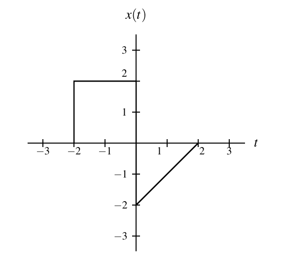
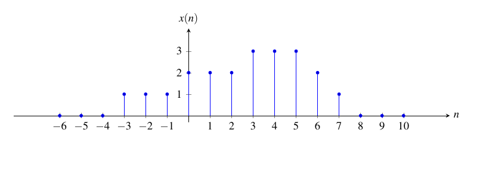
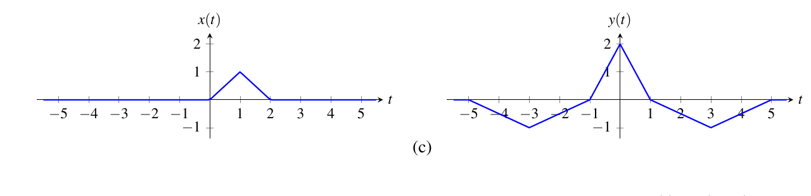

# ECE265 Tutorial 2

# Signals and Systems: A Short Recap

T02 · Ruilin Wang  
Sep 24th, 2026

More detail: [Lecture Summary 1](tutorial1lecture_summary.md) and [Lecture Summary 2](tutorial2lecture_summary.md).

---

## 1. Identify the Object Before Calculating

- A **CT signal** is a function of real time, such as $x:\mathbb R\to\mathbb R$.
- A **DT signal** is a sequence indexed by integers, such as $x:\mathbb Z\to\mathbb R$.
- $x$ is the **whole signal**; $x(t)$ or $x(n)$ is **one value**.
- A mapping $f:A\to B$ has **domain** $A$ and **codomain** $B$. Its actual outputs may occupy only part of $B$.

**Check:** Does the input belong to the domain? Is the expression a whole signal, an operator, or one value?

---

## 2. Operators Act on Whole Signals

A **system operator** $H$ maps a whole signal to a whole signal: $Hx$ is the output signal; $(Hx)(t)$ is one output value.

For $H_2H_1x$, apply the **rightmost operator first**:

$$
x\longrightarrow H_1x\longrightarrow H_2H_1x.
$$

Order can change the result. For CT differentiation $D$ and time scaling $(K_ax)(t)=x(at)$, the chain rule gives

$$
(DK_ax)(t)=a\,(Dx)(at),\qquad (K_aDx)(t)=(Dx)(at).
$$

Here $(Dx)(at)=x'(at)$: differentiate $x$ first, **then** evaluate at $at$.

---

## 3. Periodicity: CT and DT Are Different

**Continuous time:** $x(t+T)=x(t)$ for every $t$, where $T>0$ is a **real number**.

**Discrete time:** $x(n+N)=x(n)$ for every integer $n$, where $N$ is a **positive integer**.

- A *period* need not be the *fundamental period* (the smallest positive one).
- For a sum, check each component first, then find a **common period**.
- CT: if the (nonconstant) periods have an irrational ratio, there is no common period and the sum is **not periodic**. DT: an LCM always exists.

**Final check:** A common period of the components is a period of their sum, but cancellation may make the sum's fundamental period smaller.

---

## 4. A Fast Test for Sinusoids

**CT:** a nonconstant sinusoid with $\omega\ne0$ has fundamental period $T_0=2\pi/|\omega|$.

**DT** (nonzero amplitude; the textbook's DT chapter writes $\Omega$ for $\omega$):

- If $\omega/(2\pi)$ is **irrational**, the sequence is **not periodic**.
- If it is **rational**, reduce it to lowest terms; the fundamental period is $N=q$:

$$
\frac{\omega}{2\pi}=\frac{p}{q},\qquad p,q\in\mathbb Z,\quad q>0,
\quad p\text{ and }q\text{ coprime}.
$$

Only exception: a sequence that is $0$ at every $n$, such as $\sin(\pi n)$, has $N=1$.

---

## 5. Time Transformations: Know What Moves

| Operation | Signal after the operation | What happens |
| --- | --- | --- |
| Shift $S_b$ | $(S_bx)(\xi)=x(\xi-b)$ | $b>0$ moves right |
| Reversal $R$ | $(Rx)(\xi)=x(-\xi)$ | Mirror about the vertical axis |
| CT scaling $K_a$ | $(K_ax)(t)=x(at)$ | $\lvert a\rvert>1$ compresses time |

Here $\xi=t$ for CT and $\xi=n$ for DT. A DT shift amount must be an **integer**.

**Important:** these operations change the *input variable*, not the signal's vertical values.

For DT, $x(mn)$ with integer $m>0$ is **downsampling** $(\downarrow m)x$: it keeps every $m$th sample and drops the rest. Some textbook exercises write this as $K_m$ applied to a sequence.

---

## 6. Map Key Points Instead of Guessing the Graph

Suppose $y(t)=x(at-b)$, with $a\ne0$. A feature at the old location $u_0$ (on the graph of $x$) appears where the new input argument equals $u_0$:

$$
at-b=u_0
\quad\Longrightarrow\quad
t=\frac{u_0+b}{a}.
$$

- Apply this to each endpoint, jump, or labelled point.
- If $a<0$, their left-to-right order reverses.
- For operator compositions, read from **right to left**.
- For DT, go backward: for each integer $n$, read $x(an-b)$. Samples that are never read are dropped.

---

## 7. Symmetry and Causal Signals

| Property ($\xi=t$ or $n$) | Test |
| --- | --- |
| Even | $x(-\xi)=x(\xi)$ |
| Odd | $x(-\xi)=-x(\xi)$ |
| Right-sided signal | $x(\xi)=0$ for every $\xi<\xi_0$, for some $\xi_0$ |
| Causal **signal** | $x(\xi)=0$ for every $\xi<0$ |

Every signal can be split into even and odd parts:

$$
x_{\mathrm e}(\xi)=\tfrac12\bigl[x(\xi)+x(-\xi)\bigr],\qquad
x_{\mathrm o}(\xi)=\tfrac12\bigl[x(\xi)-x(-\xi)\bigr].
$$

Use the definition on the **whole domain**. An odd signal has $x(0)=0$; a right-sided signal need not be causal. A causal signal and a causal *system* are different ideas.

---

## 8. Unit Steps Are On/Off Switches

The CT and DT unit steps obey the same boundary rule:

$$
u(\xi)=\begin{cases}0,&\xi<0,\\1,&\xi\ge0.\end{cases}
\qquad\text{In particular, }u(0)=1.
$$

For $a<b$, the window $u(\xi-a)-u(\xi-b)$ is on exactly when $a\le\xi<b$: the interval $[a,b)$ in CT, or $[a..b)$ in DT (integers $a,b$; samples $a,\ldots,b-1$).

**Two-case pattern:** start with a baseline $f_0(\xi)$, then switch to $f_1(\xi)$ at $a$:

$$
f_0(\xi)+\bigl[f_1(\xi)-f_0(\xi)\bigr]u(\xi-a).
$$

Because $u(0)=1$, the point $\xi=a$ gets $f_1$. If a DT problem puts $n=a$ in the $f_0$ case, switch one sample later: $u(n-a-1)$.

---

## 9. Two Different Impulses

**CT Dirac delta:** it is a generalized function; use its integral property.

$$
\int_{-\infty}^{\infty}x(t)\delta(t-t_0)\,dt=x(t_0),
\qquad
\delta(at-b)=\frac{1}{|a|}\delta\!\left(t-\frac{b}{a}\right),\ a\ne0.
$$

**DT Kronecker delta:** an ordinary sequence, $1$ at $n=0$ and $0$ elsewhere, with $\sum_{n}x(n)\delta(n-n_0)=x(n_0)$.

For a finite integral or sum, first check whether the impulse lies **inside the limits** (DT sum limits are included). If a limit contains a variable such as $t$ or $m$, the result depends on it: write it with unit steps.

For a DT delta, find the **integer** index that makes its argument zero; if there is none, that term is $0$. Do **not** carry the CT factor $1/|a|$ into DT.

---

## 10. MATLAB: Apply a Rule to Every Element

| Goal | MATLAB operator |
| --- | --- |
| Multiply corresponding entries | `.*` |
| Divide corresponding entries | `./` |
| Raise each entry to a power | `.^` |

An array comparison such as `t >= a` creates a logical mask. Combine array conditions with **`&`**, not the scalar short-circuit operator `&&`.

For example, `(t >= a) & (t < b)` is the MATLAB **indicator** of $[a,b)$. For $u(t)$, use `double(t >= 0)`, not `heaviside(t)`, which returns $0.5$ at $t=0$.

Reference: [MathWorks on element-wise multiplication](https://www.mathworks.com/help/matlab/ref/double.times.html) and [logical AND](https://www.mathworks.com/help/matlab/ref/double.and.html).

---

## 11. MATLAB: Periodic Indices Wrap Around

One period of a period-$N$ sequence is $x(0),x(1),\ldots,x(N-1)$. In MATLAB these values sit in `x(1)` through `x(N)`: math index $k$ is stored in `x(k+1)`.

- `mod(k,N)` maps an integer $k$ into $0,1,\ldots,N-1$ when $N>0$, including when $k$ is negative.
- A shift to the **right** by $r>0$ (delay) means the new sample at index $k$ reads the old sample at index $k-r$. (In problem 8.201, the shift amount is the argument `n`.)
- Check a proposed rule using shifts $0$, $1$, $-1$, and one full period $N$.

Reference: [MathWorks on `mod`](https://www.mathworks.com/help/matlab/ref/double.mod.html).

---

# Assignment 2A: Selected Worked Examples

We will choose a few to discuss in class; the rest are here for self-study.

Questions are welcome during the tutorial or by email.

---

### 2.4(h): Mapping types in the slides

- **Printed slide pp. 17-18:** mapping, function, and sequence.
- **Printed slide pp. 20-21:** operator and system operator.
- **Printed slide p. 25:** mapping-type summary.
- **Printed slide p. 45:** DT downsampling, $(\downarrow m)x(n)=x(mn)$.

**Notation caution:** Slide p. 43 defines $K_a$ for CT functions only. Exercise 2.4 separately defines its own $G_1=K_3$ on sequences; slide p. 45 is the DT analogy.

---

## 2.4(h): Problem

Let $n$ be an integer variable and $n_1$ and $n_2$ be integer constants. Let $t$ be a real variable and $t_1$ and $t_2$ be real constants. Let $F$ be the set of all functions that map $\mathbb R$ to $\mathbb R$ and $G$ be the set of all sequences that map $\mathbb Z$ to $\mathbb R$. Let $D$ denote the differentiation operator (whose domain is the set of all differentiable functions). Let $(S_bx)(\xi)=x(\xi-b)$ and $(K_ax)(\xi)=x(a\xi)$, where $a$ and $b$ are real constants. Define the mappings

$$
f_1:\mathbb R\to\mathbb R,\text{ where }f_1(\xi)=\sin(\xi),\quad
f_2:\mathbb R\to\mathbb R,\text{ where }f_2(\xi)=e^\xi,
$$

$$
g_1:\mathbb Z\to\mathbb R,\text{ where }g_1(\xi)=\xi^2,\quad
g_2:\mathbb Z\to\mathbb R,\text{ where }g_2(\xi)=\xi-1,
$$

$$
H_1:F\to F,\text{ where }H_1=S_2,\quad\text{and}\quad
G_1:G\to G,\text{ where }G_1=K_3.
$$

For each of the mathematical expressions below, state whether the expression is valid, and if it is, what type of mathematical object the expression represents (e.g., scalar, function, sequence, or system operator), and fully evaluate the expression.

**(h)** $G_1\{g_2\}$;

---

### 2.4(h): Knowledge points

- **Textbook:** §§2.3-2.5 (mappings, functions, sequences), §2.8 (system operators), and §8.2.3 (DT downsampling analogy).
- $g_2:\mathbb Z\to\mathbb R$ is a **whole sequence**. $g_2(n)$ is a **number** at one integer index.
- $G_1:G\to G$ accepts a whole sequence and returns a whole sequence.
- Before calculating, check whether the input object belongs to the operator's domain.

---

### 2.4(h): Core bridge formula

For any sequence $g\in G$, the definition given **in this exercise** yields

$$
(G_1g)(n)=(K_3g)(n)=g(3n),\qquad n\in\mathbb Z.
$$

The expression $G_1\{g\}$ denotes the **whole output sequence**; the braces only mark the operator's input, so $G_1\{g\}$ means the same as $G_1g$. The expression $(G_1g)(n)$ denotes its value at the particular index $n$.

---

### 2.4(h): Answer

1. $g_2\in G$ because $g_2:\mathbb Z\to\mathbb R$. Therefore $G_1\{g_2\}$ is **valid**: the input lies in the domain of $G_1$.
2. $G_1:G\to G$, so the result is a **sequence**, not one scalar value.
3. Substitute the definition of $G_1$ and then $g_2(\xi)=\xi-1$:

$$
(G_1g_2)(n)=(K_3g_2)(n)=g_2(3n)=(3n)-1=3n-1,
\qquad n\in\mathbb Z.
$$

**Final:** $G_1\{g_2\}$ is the sequence $n\mapsto 3n-1$.

---

## 8.4(c): Problem

Determine if each sequence $x$ given below is periodic, and if it is, find its fundamental period $N$.

**(c)** $x(n)=\sin\left(\dfrac{6\pi}{7}n+1\right)$;

---

### 8.4(c): Knowledge points

- **Printed slide pp. 32, 34:** DT periodicity and fundamental period.
- **Printed slide p. 63:** periodicity of a real sinusoidal sequence.
- **Textbook:** §2.10.2 (periodicity), §8.3.2 (DT periodicity), and §8.4.1 (real sinusoidal sequences).
- The phase $+1$ changes the sample values, but it does not change the frequency $\omega$.

---

### 8.4(c): Core bridge formulas

An integer $N>0$ is a period when

$$
x(n+N)=x(n)\qquad\text{for every }n\in\mathbb Z.
$$

For a DT sinusoid $A\sin(\omega n+\theta)$ with $A\ne0$, find the **smallest** integer $N>0$ such that $\omega N=2\pi k$ for some integer $k$. Equivalently, if

$$
\frac{\omega}{2\pi}=\frac{p}{q}
\quad\text{in lowest terms with }q>0,
$$

then the fundamental period is $N=q$.

---

### 8.4(c): Answer

The angular frequency is $\omega=6\pi/7$; the $+1$ is the phase. Divide by $2\pi$ and reduce:

$$
\frac{\omega}{2\pi}=\frac{6\pi/7}{2\pi}=\frac{3}{7}.
$$

To make the phase repeat, we need $(6\pi/7)N=2\pi k$ for some integer $k$. Multiply both sides by $7/(2\pi)$ to get $3N=7k$. So $7$ divides $3N$; since $7$ has no common factor with $3$, $7$ must divide $N$. The smallest positive choice is $N=7$. Check by direct substitution:

$$
x(n+7)=\sin\left(\frac{6\pi}{7}(n+7)+1\right)
=\sin\left(\frac{6\pi}{7}n+1+6\pi\right)=x(n).
$$

**Final:** The sequence is periodic with fundamental period $\boxed{N=7}$.

---

## 3.6(h): Problem

Determine if each function $x$ given below is periodic, and if it is, find its fundamental period.

**(h)** $x(t)=\cos(6\sqrt{2}t)+\sin(15\sqrt{2}t)$.

---

### 3.6(h): Knowledge points

- **Printed slide pp. 32, 34-36:** periodicity, fundamental period, LCM, and sums of periodic signals.
- **Printed slide p. 62:** period of a CT real sinusoid.
- **Textbook:** §2.10.2 (periodicity), §3.4.2 (periodicity of functions), and §3.5.1 (real sinusoidal functions).
- The period of the sum must make both different-frequency components repeat, unless the terms cancel each other.

---

### 3.6(h): Core bridge formulas

For a nonconstant CT sinusoid $A\cos(\omega t+\theta)$ or $A\sin(\omega t+\theta)$,

$$
T_0=\frac{2\pi}{|\omega|}.
$$

For two noncancelling sinusoidal components, seek the smallest $T>0$ for which **both** phases change by integer multiples of $2\pi$:

$$
\omega_1 T=2\pi m,\qquad \omega_2 T=2\pi k,
\qquad m,k\in\mathbb Z_{>0}.
$$

---

### 3.6(h): Answer - component periods

The two angular frequencies are $6\sqrt{2}$ and $15\sqrt{2}$. Their individual fundamental periods are

$$
T_1=\frac{2\pi}{6\sqrt{2}}=\frac{\pi}{3\sqrt{2}},
\qquad
T_2=\frac{2\pi}{15\sqrt{2}}.
$$

Their ratio is rational:

$$
\frac{T_1}{T_2}
=\frac{\pi/(3\sqrt{2})}{2\pi/(15\sqrt{2})}
=\frac{15}{6}=\frac{5}{2}.
$$

Thus a common period exists.

---

### 3.6(h): Answer - smallest common period

Set $T=mT_1=kT_2$ with positive integers $m,k$. Dividing by $T_2$ gives $m\,(T_1/T_2)=k$, i.e. $\tfrac52m=k$, so $5m=2k$. The smallest positive solution is $m=2$ and $k=5$:

$$
T=2T_1=5T_2=\frac{2\pi}{3\sqrt{2}}.
$$

Check the phase changes after this shift:

$$
(6\sqrt{2})T=4\pi,\qquad (15\sqrt{2})T=10\pi.
$$

Both components repeat, so $T$ is a period of the sum. By the rule on slide p. 36, this smallest common period is also the **fundamental** period unless the terms cancel, and a cosine and a sine with different frequencies cannot cancel. For instance, shifting by $T/2$ gives $\cos(6\sqrt2t)-\sin(15\sqrt2t)\ne x(t)$.

$$
\boxed{T_0=\frac{2\pi}{3\sqrt{2}}=\frac{\sqrt2\,\pi}{3}}.
$$

---

## 8.5(c): Problem

Determine if each sequence $x$ given below is periodic, and if it is, find its fundamental period $N$.

**(c)** $x(n)=\sin(0.3\pi n)+\cos(0.45\pi n)$;

---

### 8.5(c): Knowledge points

- **Printed slide pp. 32, 34-36:** DT period, fundamental period, and period of a sum.
- **Printed slide p. 63:** rational-frequency test for a DT sinusoid.
- **Textbook:** §2.10.2 (periodicity), §8.3.2 (DT periodicity), and §8.4.1 (real sinusoidal sequences).
- For DT signals, the common period must be an **integer**. Reduce decimal frequency ratios to exact fractions before taking an LCM.

---

### 8.5(c): Core bridge formulas

For each sinusoid with nonzero amplitude, reduce $\omega/(2\pi)$:

$$
\frac{\omega_i}{2\pi}=\frac{p_i}{q_i}
\quad\text{in lowest terms}
\quad\Longrightarrow\quad N_i=q_i.
$$

For a sum of periodic sequences, a common period is

$$
N=\mathrm{lcm}(N_1,N_2).
$$

It is also the **fundamental** period of the sum unless the terms cancel (slide p. 36); the check below confirms this directly.

---

### 8.5(c): Answer - component periods

Convert the decimal coefficients to exact fractions:

$$
\omega_1=0.3\pi=\frac{3\pi}{10},\qquad
\frac{\omega_1}{2\pi}=\frac{3}{20}
\quad\Longrightarrow\quad N_1=20.
$$

$$
\omega_2=0.45\pi=\frac{9\pi}{20},\qquad
\frac{\omega_2}{2\pi}=\frac{9}{40}
\quad\Longrightarrow\quad N_2=40.
$$

Thus $N=\mathrm{lcm}(20,40)=40$ is a period of the sum.

---

### 8.5(c): Answer - check the period

Substitute $n+40$ into both terms:

$$
\begin{aligned}
x(n+40)
&=\sin(0.3\pi n+12\pi)+\cos(0.45\pi n+18\pi)\\
&=\sin(0.3\pi n)+\cos(0.45\pi n)=x(n).
\end{aligned}
$$

So $40$ is definitely a period. The next slide checks that the sum does not have a smaller fundamental period.

---

### 8.5(c): Answer - exclude shorter periods

Every period of a sequence is an integer multiple of its fundamental period $N_0$. (Otherwise, writing the period as $qN_0+r$ with $0<r<N_0$, the remainder $r$ would be an even smaller period.) Since $40$ is a period, $N_0$ divides $40$: it is $40$ or one of the proper divisors $1,2,4,5,8,10,20$, all of which divide $20$ except $8$.

- $x(0)=1$ but $x(20)=\sin(6\pi)+\cos(9\pi)=0+(-1)=-1$, so $20$ is **not** a period. Then no divisor $d$ of $20$ is a period either: if $d$ were, $20=(20/d)\,d$ would be a period too.
- $x(8)=\sin(12\pi/5)+\cos(18\pi/5)$. Since $12\pi/5=2\pi+2\pi/5$ and $18\pi/5=4\pi-2\pi/5$, this equals $\sin(2\pi/5)+\cos(2\pi/5)\approx0.951+0.309=1.260\ne1=x(0)$, so $8$ is **not** a period.

No proper divisor works. **Final:** $\boxed{N_0=40}$.

---

## 3.34(a): Problem

> Let $\mathcal K_a$ denote an operator that time scales by $a$, where $a$ is constrained such that $a>0$. Let $\mathcal S_b$ denote an operator that time shifts by $b$. Let $\mathcal R$ denote the time reversal operator. Let $\mathcal I$ denote the identity operator (i.e., $\mathcal I x=x$ for all $x$). For each equation relating the two functions $y$ and $x$, express $y$ in terms of $x$ using only the preceding operators (and scalar multiplication).

> The solution is subject to the following constraints: 1) time scaling operators must only employ strictly positive scale factors; and 2) if both time-scaling and time-shifting operators are employed, the time-shifting operator must be applied first. [Hint for parts (e) and (f): The operators $\mathcal K_{(\cdot)}$, $\mathcal S_{(\cdot)}$, $\mathcal R$, and $\mathcal I$ are linear. For any two linear operators $\mathcal F$ and $\mathcal G$, $(\mathcal F+\mathcal G)x=\mathcal F x+\mathcal Gx$.]

> (a) $y(t)=x(4+3t)$;

Textbook: Exercise 3.34, printed p. 75.

---

### 3.34(a): Knowledge and bridge

**Review:** slides pp. 38, 43, 47–49; textbook §§3.2.1, 3.2.4–3.2.5.

**Notation:** the textbook writes the operators in script font ($\mathcal S_b,\mathcal K_a,\mathcal R,\mathcal I$). They are the same operators as $S_b,K_a,R$ on the recap slides.

**Core definitions** (for any function $f$):

$$
(\mathcal S_b f)(t)=f(t-b),\qquad
(\mathcal K_a f)(t)=f(at),\quad a>0.
$$

**Composition, shift first:**

$$
(\mathcal K_a\mathcal S_bx)(t)
=(\mathcal S_bx)(at)=x(at-b).
$$

The operator nearest $x$ acts first.

---

### 3.34(a): Full answer

We need $at-b=4+3t$. Match the coefficient of $t$ and the constant:

$$
a=3>0,\qquad -b=4\ \Longrightarrow\ b=-4.
$$

Shift first by $-4$, that is, shift **left** by $4$:

$$
(\mathcal S_{-4}x)(t)=x(t-(-4))=x(t+4).
$$

Then time scale by $3$: replace $t$ by $3t$ in $x(t+4)$:

$$
(\mathcal K_3\mathcal S_{-4}x)(t)
=(\mathcal S_{-4}x)(3t)=x(3t+4)=y(t).
$$

**Answer:** $\boxed{y=\mathcal K_3\mathcal S_{-4}x}$.

---

## 8.1(d): Problem

> Let $\mathcal S_b$ denote an operator that time shifts by $b$. Let $\downarrow M$ denote the $M$-fold downsampling operator (where $M\ge1$). Let $\mathcal R$ denote the time reversal operator. Let $\mathcal I$ denote the identity operator (i.e., $\mathcal I x=x$ for all $x$). For each equation relating the two sequences $y$ and $x$, express $y$ in terms of $x$ using only the preceding operators (and scalar multiplication).

> [Hint for parts (e) and (f): The operators $\mathcal S_{(\cdot)}$, $\downarrow(\cdot)$, $\mathcal R$, and $\mathcal I$ are linear. For any two linear operators $\mathcal F$ and $\mathcal G$, $(\mathcal F+\mathcal G)x=\mathcal Fx+\mathcal Gx$.]

> (d) $y(n)=x(-7n-3)$;

Textbook: Exercise 8.1, printed p. 392.

---

### 8.1(d): Knowledge and bridge

**Review:** slides pp. 38, 41, 45, 47–48, 50; textbook §§8.2.1–8.2.3, 8.2.5.

**Notation:** $\mathcal S_b$ and $\mathcal R$ are the textbook's script-font names for $S_b$ and $R$.

**Core definitions** (integer $n,b$; integer $M\ge1$):

$$
(\mathcal S_b f)(n)=f(n-b),\qquad
((\downarrow M)f)(n)=f(Mn),\qquad
(\mathcal Rf)(n)=f(-n).
$$

**Shift, downsample, then reverse:**

$$
[\mathcal R(\downarrow M)\mathcal S_bx](n)=x(-Mn-b).
$$

---

### 8.1(d): Full answer

Match $-Mn-b=-7n-3$: $M=7$ and $b=3$.

First, shift $x$ right by $3$:

$$
z(n)=(\mathcal S_3x)(n)=x(n-3).
$$

Next, downsample by $7$:

$$
q(n)=((\downarrow7)z)(n)=z(7n)=x(7n-3).
$$

Finally, reverse time:

$$
(\mathcal Rq)(n)=q(-n)=x(7(-n)-3)=x(-7n-3).
$$

**Answer:** $\boxed{y=\mathcal R(\downarrow7)\mathcal S_3x}$.

This answer is not unique: $(\downarrow7)\mathcal S_{-3}\mathcal Rx$ and $(\downarrow7)\mathcal R\mathcal S_3x$ are also correct. (Exercise 3.34 fixes the order of the operators; Exercise 8.1 does not.) To check any form, apply it step by step and compare with $x(-7n-3)$.

---

## 3.4(e): Problem

> Given the function $x$ shown in the figure below, plot and label each of the following functions:

> (e) $\frac14 x\!\left(-\frac12t+1\right)-\frac12$.

<!-- FIGURE: textbook printed p.70, exercise 3.4, graph of x(t). It is 0 outside [-2,2], height 2 on (-2,0), and a rising line from (0,-2) to (2,0); jump-point membership is not marked. -->



Textbook: Exercise 3.4, printed p. 70.

---

### 3.4(e): Knowledge and bridge

**Review:** slides pp. 38–43, 49; textbook §§3.2.1–3.2.5 and §3.3.

For the general transformation $y(t)=c\,x(at-b)+d$, write $u=at-b$ for the argument of $x$:

1. An old feature at $u=u_0$ appears where $at-b=u_0$, so

   $$t=\frac{u_0+b}{a}\quad(a\ne0).$$

2. Its old height $x(u_0)$ becomes $c\,x(u_0)+d$.

3. If $a<0$, the left-to-right order reverses. Apply the amplitude rule **after** finding the old $x$ value.

---

### 3.4(e): Answer, horizontal map

Here $a=-\tfrac12$, $b=-1$, $c=\tfrac14$, and $d=-\tfrac12$, so the source argument is $u=1-\tfrac12t$. An old breakpoint at $u_0$ moves to

$$
1-\frac12t=u_0\quad\Longrightarrow\quad t=2(1-u_0).
$$

| Old breakpoint $u_0$ | New location $t$ | Check |
| --- | ---: | --- |
| $-2$ | $2(1-(-2))=6$ | left edge moves to right |
| $0$ | $2(1-0)=2$ | jump moves to $2$ |
| $2$ | $2(1-2)=-2$ | right edge moves to left |

The transformed graph must therefore change form at $t=-2,2,6$.

---

### 3.4(e): Answer, heights and sketch

Read the source graph as $x(u)=0$ outside $[-2,2]$, $x(u)=2$ for $-2<u<0$, and $x(u)=u-2$ for $0<u<2$.

$$
y(t)=\begin{cases}
-\frac12, & t<-2,\\
\frac14(1-\frac12t-2)-\frac12=-\frac34-\frac18t, & -2<t<2,\\
\frac14(2)-\frac12=0, & 2<t<6,\\
-\frac12, & t>6.
\end{cases}
$$

At $t=-2$, $u=2$ and $y(-2)=\tfrac14x(2)-\tfrac12=-\tfrac12$. Plot a line from $(-2,-\tfrac12)$ to $(2,-1)$, a horizontal segment at $0$ from $2$ to $6$, and baseline $-\tfrac12$ elsewhere. The source graph does not mark which branch owns its jumps, so it does not fix the exact values at $t=2$ and $t=6$.

---

## 8.2(f): Problem

> Given the sequence $x$ shown in the figure below, sketch a graph of each sequence $y$ given below.

> (f) $y(n)=x(1-2n)$.

<!-- FIGURE: textbook printed p.392, exercise 8.2, stem plot of x(n). Nonzero samples: x(-3)=x(-2)=x(-1)=1; x(0)=x(1)=x(2)=2; x(3)=x(4)=x(5)=3; x(6)=2; x(7)=1. -->



Textbook: Exercise 8.2, printed p. 392.

---

### 8.2(f): Knowledge and bridge

**Review:** slides pp. 38, 41, 45, 50; textbook §§8.2.1–8.2.3, 8.2.5.

For $y(n)=x(an-b)$, the output sample $n$ reads the source sample $k=an-b$.

To map an old nonzero sample at $k$ to its new position, solve

$$
k=an-b\quad\Longrightarrow\quad n=\frac{k+b}{a}.
$$

Only **integer** $n$ are output positions. If $(k+b)/a\notin\mathbb Z$, that old source sample is not used. Negative $a$ reverses the sample order.

---

### 8.2(f): Answer, source-to-output map

Here $k=1-2n$, so $a=-2$ and $b=-1$, and $n=(k+b)/a=(k-1)/(-2)=(1-k)/2$. The selected source indices are odd.

| Source $k$ | $x(k)$ | New $n=(1-k)/2$ | $y(n)$ |
| ---: | ---: | ---: | ---: |
| $7$ | $1$ | $(1-7)/2=-3$ | $y(-3)=1$ |
| $5$ | $3$ | $(1-5)/2=-2$ | $y(-2)=3$ |
| $3$ | $3$ | $(1-3)/2=-1$ | $y(-1)=3$ |
| $1$ | $2$ | $(1-1)/2=0$ | $y(0)=2$ |
| $-1$ | $1$ | $(1+1)/2=1$ | $y(1)=1$ |
| $-3$ | $1$ | $(1+3)/2=2$ | $y(2)=1$ |

---

### 8.2(f): Answer, completed stem plot

Plot stems at the six points

$$
(-3,1),\ (-2,3),\ (-1,3),\ (0,2),\ (1,1),\ (2,1).
$$

All other output samples are zero. For example,

$$
y(-4)=x(1-2(-4))=x(9)=0,\qquad
y(3)=x(1-2(3))=x(-5)=0.
$$

Notice that the nonzero even-indexed source samples $x(-2),x(0),x(2),x(4),x(6)$ are dropped: $1-2n$ can never be even.

---

## 3.2(c): Problem

> For the case of each pair of functions $x$ and $y$ given below, find $y$ in terms of $x$. The expression for $y$ should have a minimal number of terms.

<!-- FIGURE: textbook printed p.69, exercise 3.2(c), paired graphs. Source x: triangle through (0,0),(1,1),(2,0), zero elsewhere. Target y: negative triangle (-5,0),(-3,-1),(-1,0); positive triangle (-1,0),(0,2),(1,0); negative triangle (1,0),(3,-1),(5,0); zero elsewhere. Crop the entire paired row labelled (c). -->



Textbook: Exercise 3.2, printed p. 69.

---

### 3.2(c): Knowledge and bridge

**Review:** slides pp. 38, 43, 49; textbook §§3.2.1, 3.2.4–3.2.5, 3.3.

For a scaled and shifted copy $g(t)=c\,x(at-b)$:

- An old feature at $u_0$ appears where $at-b=u_0$, so $t=(u_0+b)/a$.
- The feature's new height is $c\,x(u_0)$.
- A wider copy has $|a|<1$; a narrower copy has $|a|>1$.

If separated pieces of $y$ are copies of $x$, write one transformed term for each piece and add them.

---

### 3.2(c): Answer, read the three triangles

The source $x$ is zero outside $[0,2]$, has peak $x(1)=1$, and is zero at both endpoints.

| Piece of $y$ | Interval | Peak | Required change |
| --- | --- | --- | --- |
| Left | $[-5,-1]$ | $y(-3)=-1$ | width $4$; negate |
| Middle | $[-1,1]$ | $y(0)=2$ | width $2$; double |
| Right | $[1,5]$ | $y(3)=-1$ | width $4$; negate |

The original width is $2$, so each outer triangle stretches time by $2$, corresponding to an argument with coefficient $\tfrac12$.

---

### 3.2(c): Answer, build each copy

**Left:** map old $u=0,1,2$ to $t=-5,-3,-1$. The argument $u$ of $x$ is a linear function of $t$ with $u=0$ at $t=-5$ and $u=2$ at $t=-1$; its slope is $(2-0)/(-1-(-5))=\tfrac12$, so $u=(t+5)/2$ and the term is $-x((t+5)/2)$.

**Middle:** map old $u=0,1,2$ to $t=-1,0,1$. Now the slope is $(2-0)/(1-(-1))=1$, so $u=t+1$. Height $1$ must become $2$, so the term is $2x(t+1)$.

**Right:** map old $u=0,1,2$ to $t=1,3,5$. The slope is again $\tfrac12$, and $u=0$ at $t=1$, so $u=(t-1)/2$ and the term is $-x((t-1)/2)$.

Each term is zero outside its own interval; the three intervals only meet where the terms equal zero.

---

### 3.2(c): Full answer and numerical checks

$$
\boxed{
y(t)=-x\!\left(\frac{t+5}{2}\right)
+2x(t+1)
-x\!\left(\frac{t-1}{2}\right).}
$$

At the three peaks:

$$
y(-3)=-x(1)+2x(-2)-x(-2)=-1,
$$

$$
y(0)=-x(5/2)+2x(1)-x(-1/2)=2,
$$

$$
y(3)=-x(4)+2x(4)-x(1)=-1.
$$

The result uses one term per nonzero triangular piece: three terms in total.

---

## 3.9(b): Problem

Determine whether each function $x$ given below is even, odd, or neither even nor odd.

**(b)** $x(t)=t^3|t|$;

---

### 3.9(b): Knowledge and bridge

**Find it again:** Lecture slides pp. 27–28, *Even Symmetry* and *Odd Symmetry*; textbook §3.4, *Properties of Functions*.

For a CT function $x$ on the whole real line:

$$
\text{even: }x(-t)=x(t),\qquad
\text{odd: }x(-t)=-x(t)\quad\text{for every }t.
$$

The absolute-value rule needed here is $|-t|=|t|$.

---

### 3.9(b): Answer

Substitute $-t$ into the **entire** expression:

$$
x(-t)=(-t)^3|-t|=(-t^3)|t|=-t^3|t|=-x(t).
$$

For example, $x(2)=2^3|2|=8(2)=16$ and $x(-2)=(-2)^3|-2|=(-8)(2)=-16$.

Because $x(-t)=-x(t)$ for every real $t$, **$x$ is odd**.

---

## 3.10(f): Problem

Prove each of the following assertions:

**(f)** The product of an even function and an odd function is odd.

---

### 3.10(f): Knowledge and bridge

**Find it again:** Lecture slides pp. 27–29, *Even Symmetry*, *Odd Symmetry*, and *Symmetry and Addition/Multiplication*; textbook §3.4.

Let $f$ be even and $g$ be odd. The **definitions**, rather than one numerical example, give

$$
f(-t)=f(t),\qquad g(-t)=-g(t)\quad\text{for every }t.
$$

If their product is $h(t)=f(t)g(t)$, proving $h$ odd means proving $h(-t)=-h(t)$ for **every** $t$.

---

### 3.10(f): Answer

Evaluate the product at $-t$ and substitute the two symmetry rules:

$$
\begin{aligned}
h(-t)&=f(-t)g(-t)\\
&=f(t)[-g(t)]\\
&=-f(t)g(t)=-h(t).
\end{aligned}
$$

This proves that the product is odd. As a numerical check, take $f(t)=t^2+1$ and $g(t)=t$: $h(2)=(4+1)(2)=10$, while $h(-2)=(4+1)(-2)=-10$.

---

## 3.17(d): Problem

For each case below, for the function $x$ (of a real variable) having the properties stated, find $x(t)$ for all $t$.

**(d)** The function $x$ is such that:

- the function $v$ is even, where $v(t)=x(t+1)$;
- the function $w$ is causal, where $w(t)=x(t-1)-1$; and
- $x(t)=-t$ for $-1\le t\le 1$.

---

### 3.17(d): Knowledge and bridge

**Find it again:** Lecture slides p. 27 (even), pp. 38–39 (time shift), p. 52 (causal signal); textbook §§3.2 and 3.4.

The general rules to translate into conditions on $x$ are

$$
v(-t)=v(t)\quad\text{for every }t,
\qquad
w(t)=0\quad\text{for }t<0.
$$

For a shifted signal, substitute into its **definition** before imposing symmetry or causality. In particular, “$w$ causal” concerns the output $w(t)=x(t-1)-1$, not $x(t)$ itself.

---

### 3.17(d): Answer, left side

The causal condition sets $w(t)=0$ for every $t<0$:

$$
0=w(t)=x(t-1)-1
\quad\Longrightarrow\quad x(t-1)=1\quad(t<0).
$$

Set $s=t-1$. Since $t<0$ means $s<-1$,

$$
x(s)=1\qquad(s<-1).
$$

Thus $x(-2)=1$. The given formula handles the next interval: $x(-1)=1$, $x(0)=0$, and $x(1)=-1$.

---

### 3.17(d): Answer, mirrored right side

Since $v$ is even, $v(t)=v(-t)$ for every $t$:

$$
x(t+1)=x(1-t).
$$

Putting $s=t+1$ gives $x(s)=x(2-s)$. The mirror is centered at **$s=1$**.

- For $1<s\le3$, $2-s\in[-1,1)$, so $x(s)=x(2-s)=-(2-s)=s-2$.
- For $s>3$, $2-s<-1$, so $x(s)=x(2-s)=1$.

For example, $x(2)=x(0)=0$, $x(3)=x(-1)=1$, and $x(4)=x(-2)=1$.

---

### 3.17(d): Answer for all real $t$

Combining the given middle interval with the two deductions:

$$
\boxed{x(t)=
\begin{cases}
1,&t<-1,\\
-t,&-1\le t\le 1,\\
t-2,&1<t\le3,\\
1,&t>3.
\end{cases}}
$$

At the boundaries, the pieces agree: $x(-1)=1$, $x(1)=-1$, and $x(3)=1$. The resulting $v(t)=x(t+1)$ is even, and $w(t)=x(t-1)-1=0$ for $t<0$.

---

## 8.14(a), adapted: Problem

For each case below, for the sequence $x$ having the properties stated, find $x(n)$ for all $n$.

**(a)** The sequence $x$ is such that:

- $x(n)=2n^2$ for $n\in[-1..1]$;
- the sequence $v$ is causal, where $v(n)=x(n-1)$; and
- the sequence $w$ is odd, where $w(n)=x(n+2)$.

Only the factor $2$ in the first bullet differs from the textbook exercise.

---

### 8.14(a), adapted: Knowledge and bridge

**Find it again:** Lecture slides p. 28 (odd), pp. 38 and 40 (time shift), p. 52 (causal sequence); textbook §8.3, *Properties of Sequences*.

For an integer-indexed sequence, the rules are

$$
v(n)=0\quad(n<0),\qquad
w(-n)=-w(n)\quad(n\in\mathbb Z).
$$

Apply the rules to $v$ and $w$ **as defined**. For $w(n)=x(n+2)$, its odd-symmetry center $n=0$ corresponds to the original sequence's center $n=2$.

---

### 8.14(a), adapted: Answer, known samples

First use the given formula at the **three integers** in $[-1..1]$:

$$
x(-1)=2(-1)^2=2,\qquad x(0)=2(0)^2=0,\qquad x(1)=2(1)^2=2.
$$

Next, causality gives $v(n)=0$ for $n<0$. With $v(n)=x(n-1)$, set $k=n-1$:

$$
x(k)=0\quad\text{for every integer }k\le-2.
$$

So the left side is known **all the way to $-\infty$**, not only at $x(-2)$.

---

### 8.14(a), adapted: Answer, odd symmetry

Oddness means $w(-r)=-w(r)$ for every integer $r$. Substitute $w(n)=x(n+2)$:

$$
x(2-r)=-x(2+r).
$$

This is **odd symmetry about $n=2$**. Now reflect the known samples:

$$
\begin{aligned}
r=0:&\quad x(2)=-x(2)\ \Rightarrow\ x(2)=0,\\
r=1:&\quad x(3)=-x(1)=-2,\\
r=2:&\quad x(4)=-x(0)=0,\\
r=3:&\quad x(5)=-x(-1)=-2.
\end{aligned}
$$

---

### 8.14(a), adapted: Answer for all integers $n$

For $r\ge4$, the reflected index $2-r\le-2$ has $x(2-r)=0$. Hence $x(2+r)=0$, so $x(n)=0$ for every $n\ge6$.

The **complete sequence** has only four nonzero samples:

$$
\boxed{x(-1)=2,\quad x(1)=2,\quad x(3)=-2,\quad x(5)=-2;\qquad x(n)=0\text{ otherwise}.}
$$

Check: $v(n)=x(n-1)=0$ when $n<0$, and every pair about $n=2$ has opposite values: $x(1)=2=-x(3)$ and $x(-1)=2=-x(5)$.

---

## 3.22(a): Problem

For each function $x$ given below, find a single expression for $x$ (i.e., an expression that does not involve multiple cases). Group similar unit-step function terms together in the expression for $x$.

$$
x(t)=
\begin{cases}
-t-3 & -3\le t<-2,\\
-1 & -2\le t<-1,\\
t^3 & -1\le t<1,\\
1 & 1\le t<2,\\
-t+3 & 2\le t<3,\\
0 & \text{otherwise}
\end{cases};
$$

---

### 3.22(a): Knowledge to Review

**Slides:** §2.5, printed pp. 87–94: unit step, indicators, and piecewise functions.

**Textbook:** §§3.5.4 and 3.6: unit-step functions and piecewise representations.

**Bridge from definition to problem:** because $u(t-a)=1$ for $t\ge a$ and $0$ otherwise,

$$
u(t-a)-u(t-b)=
\begin{cases}1,&a\le t<b,\\0,&\text{otherwise},\end{cases}
\qquad a<b.
$$

Multiply each case formula by the window for its interval, then add the terms.

---

### 3.22(a): Answer - Turn Cases into Windows

The five nonzero intervals have windows

$$
\begin{aligned}
[-3,-2)&: u(t+3)-u(t+2),\\
[-2,-1)&: u(t+2)-u(t+1),\\
[-1,1)&: u(t+1)-u(t-1),\\
[1,2)&: u(t-1)-u(t-2),\\
[2,3)&: u(t-2)-u(t-3).
\end{aligned}
$$

For example, $u(t+3)-u(t+2)=1$ only when $-3\le t<-2$.

---

### 3.22(a): Answer - Multiply and Add

Insert each case formula into its own window:

$$
\begin{aligned}
x(t)={}&(-t-3)[u(t+3)-u(t+2)]\\
&-[u(t+2)-u(t+1)]\\
&+t^3[u(t+1)-u(t-1)]\\
&+[u(t-1)-u(t-2)]\\
&+(-t+3)[u(t-2)-u(t-3)].
\end{aligned}
$$

The $0$-otherwise case contributes nothing.

---

### 3.22(a): Answer - Group Similar Step Terms

Each window $f(t)[u(t-c_1)-u(t-c_2)]$ gives $+f(t)$ to the step that opens it and $-f(t)$ to the step that closes it. Collect the contributions for each distinct step:

| Step | From the window it closes | From the window it opens | Coefficient |
| --- | --- | --- | --- |
| $u(t+3)$ | none | $-t-3$ | $-t-3$ |
| $u(t+2)$ | $-(-t-3)=t+3$ | $-1$ | $t+2$ |
| $u(t+1)$ | $-(-1)=1$ | $t^3$ | $t^3+1$ |
| $u(t-1)$ | $-t^3$ | $1$ | $1-t^3$ |
| $u(t-2)$ | $-1$ | $-t+3$ | $2-t$ |
| $u(t-3)$ | $-(-t+3)=t-3$ | none | $t-3$ |

Therefore

$$
\begin{aligned}
x(t)={}&(-t-3)u(t+3)+(t+2)u(t+2)\\
&+(t^3+1)u(t+1)+(1-t^3)u(t-1)\\
&+(2-t)u(t-2)+(t-3)u(t-3).
\end{aligned}
$$

Check $2\le t<3$: the first five terms sum to $(-t-3)+(t+2)+(t^3+1)+(1-t^3)+(2-t)=3-t$. At $t\ge3$, the final term also turns on and the sum becomes $0$.

---

## 8.17(a): Problem

For each sequence $x$ given below, use the unit-step sequence to find a single expression for $x(n)$ that is valid for all $n$ (i.e., an expression that does not involve multiple cases). Group similar unit-step sequence terms together in the expression for $x(n)$.

$$
x(n)=
\begin{cases}
n^2+1 & n\in[0..8],\\
0 & \text{otherwise}
\end{cases};
$$

---

### 8.17(a): Knowledge to Review

**Slides:** §2.5, printed pp. 87–94: the DT unit step and finite-duration sequences.

**Textbook:** §§8.4.4–8.4.5 and 8.5: unit-step sequences and piecewise representations.

**Bridge from definition to problem:** for integer $a\le b$,

$$
u(n-a)-u(n-b-1)=
\begin{cases}1,&n\in[a..b],\\0,&\text{otherwise}.
\end{cases}
$$

The step that ends the window starts at $b+1$, because $n=b$ is included.

---

### 8.17(a): Answer

The requested interval is $[0..8]$. Set $a=0$ and $b=8$ in the window formula:

$$
u(n-0)-u(n-8-1)=u(n)-u(n-9).
$$

Multiply by the nonzero case formula:

$$
\boxed{x(n)=(n^2+1)[u(n)-u(n-9)]}.
$$

At $n=0$ the window is $1$ and $x(0)=0^2+1=1$; at $n=8$ it is $1$ and $x(8)=8^2+1=65$. At $n=9$, both steps are $1$, so $x(9)=0$.

---

## 3.20(h): Problem

Fully simplify each of the expressions below.

$$
\text{(h)}\qquad
\frac{1}{9}\int_{-\infty}^{\infty}(\tau+6)^2
\delta\!\left(1-\frac{\tau}{3}\right)\,d\tau.
$$

---

### 3.20(h): Knowledge to Review

**Slides:** §2.5, printed pp. 97–101: CT Dirac delta, scaling, and sifting.

**Textbook:** §3.5.12: the impulse or delta function.

**Bridge from definition to problem:** for $a\ne0$ and a suitable $f$,

$$
\delta(a\tau-b)=\frac{1}{|a|}\delta\!\left(\tau-\frac{b}{a}\right),
\qquad
\int_{-\infty}^{\infty}f(\tau)\delta(\tau-\tau_0)\,d\tau=f(\tau_0).
$$

First locate the zero of the delta's argument; then account for its slope.

---

### 3.20(h): Answer - Locate and Scale the Impulse

Match the argument to the form $a\tau-b$: $1-\tau/3=(-\tfrac13)\tau-(-1)$, so $a=-\tfrac13$ and $b=-1$. The impulse sits at $\tau=b/a=3$ (check: $1-3/3=0$), and $1/|a|=3$:

$$
\delta\!\left(1-\frac{\tau}{3}\right)
=\frac{1}{|-1/3|}\delta(\tau-3)
=3\delta(\tau-3).
$$

The outer factor $1/9$ remains outside the integral.

---

### 3.20(h): Answer - Substitute the Number

Apply sifting at $\tau=3$:

$$
\begin{aligned}
\frac19\int_{-\infty}^{\infty}(\tau+6)^2
\delta\!\left(1-\frac{\tau}{3}\right)\,d\tau
&=\frac19\cdot3\int_{-\infty}^{\infty}(\tau+6)^2\delta(\tau-3)\,d\tau\\
&=\frac39(3+6)^2\\
&=\frac13\cdot81=\boxed{27}.
\end{aligned}
$$

---

## 8.16(d): Problem

Fully simplify each of the expressions below.

$$
\text{(d)}\qquad
\sum_{n=0}^{\infty}n^2\cos(n)\delta(n+10);
$$

---

### 8.16(d): Knowledge to Review

**Slides:** §2.5, printed pp. 97–101: the DT impulse sequence and sifting.

**Textbook:** §8.4.6: the unit-impulse sequence.

**Bridge from definition to problem:** $\delta(k)=1$ only when the **integer** $k=0$; otherwise $\delta(k)=0$. Thus

$$
\sum_{n\in I}f(n)\delta(n-n_0)=
\begin{cases}f(n_0),&n_0\in I,\\0,&n_0\notin I.\end{cases}
$$

Before evaluating $f$, check whether the selected index belongs to the sum's range.

---

### 8.16(d): Answer

The delta could be nonzero only if $n+10=0$, which gives $n=-10$. But the sum includes only $n=0,1,2,\ldots$; it never includes $-10$.

Therefore $\delta(n+10)=0$ at every index in the sum, and every summand is zero:

$$
\boxed{\sum_{n=0}^{\infty}n^2\cos(n)\delta(n+10)=0}.
$$

---

## D.9(a–c): Problem

Rewrite the three given MATLAB functions without changing their outputs:

- **(a)** Square every entry of a matrix; remove both `for` loops.
- **(b)** Evaluate a scalar piecewise rule; remove `if/elseif/else`.
- **(c)** Apply the same rule to every matrix entry; remove both loops and all conditional branches.

For (b) and (c), the rule is: square the input on `[1,2)`, return the input on `[2,5)`, and return zero elsewhere.

These are **pseudocode steps**, not submit-ready MATLAB. Textbook: Exercise D.9, printed pp. 728–729.

---

### D.9(a): Idea and Pseudocode

**Idea:** One operation can act on the entire matrix at once. Matrix power `^` is not the same as element-wise power `.^`.

```text
INPUT: matrix T
X <- square every entry of T simultaneously
RETURN X with the same shape as T
```

**Check:** The row `[-2, 0, 3]` should become `[4, 0, 9]`. There should be no loop over rows or columns.

---

### D.9(b): Idea and Pseudocode

**Idea:** A comparison has value 1 when true and 0 when false. Use two nonoverlapping indicators to select the two nonzero cases.

```text
INPUT: scalar t
I1 <- truth value of (t >= 1 AND t < 2)
I2 <- truth value of (t >= 2 AND t < 5)
x  <- I1 times t squared + I2 times t
RETURN x
```

There is no `if` branch: outside both intervals, `I1 = I2 = 0`. **Check the boundaries:** `t = 1` should give `1`, `t = 2` should give `2`, and `t = 5` should give `0`.

---

### D.9(c): Idea and Pseudocode

**Idea:** Repeat (b) for every entry **simultaneously**, using two logical matrices and element-wise arithmetic.

```text
INPUT: matrix T
M1 <- element-wise truth of (T >= 1 AND T < 2)
M2 <- element-wise truth of (T >= 2 AND T < 5)
X  <- element-wise product of M1 and the element-wise square of T
      + element-wise product of M2 and T
RETURN X with the same shape as T
```

In MATLAB, combine array comparisons with `&`, not `&&`; use `.^` and `.*` for element-wise arithmetic. Test entries below 1, at 1, at 2, at 5, and above 5.

---

## 8.201: Problem

Write `shift_periodic_seq(x, n)`. The input `x` stores one period of an `N`-periodic sequence, at mathematical indices `0, 1, ..., N-1`; return the shifted samples at those same indices.

A positive `n` shifts **right** (delay); a negative `n` shifts **left** (advance). The indices wrap around. Do not call MATLAB's ready-made shift function; `mod` is allowed. Textbook: Exercise 8.201, printed p. 397.

---

### 8.201: Idea and Pseudocode

**Idea:** For each output index `k`, read the old value at `k - n`. Periodicity brings that index back into `0, ..., N-1`:

```text
INPUT: one-period vector x, integer shift n
N <- number of entries in x
FOR each mathematical output index k = 0, 1, ..., N-1:
    source <- mod(k - n, N)
    y at MATLAB position k + 1 <- x at MATLAB position source + 1
RETURN y
```

The `+1` converts mathematical indices to MATLAB's 1-based positions. **Check:** for `x = [1 2 3 4]`, `n = 1` gives `[4 1 2 3]`, `n = -1` gives `[2 3 4 1]`, and `n = 4` gives the original vector.
