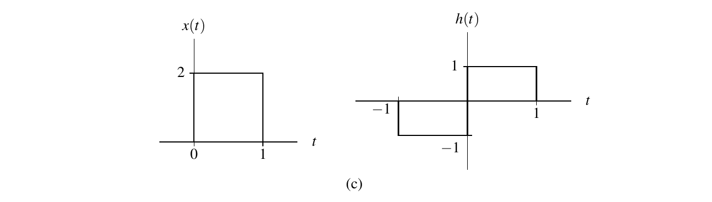
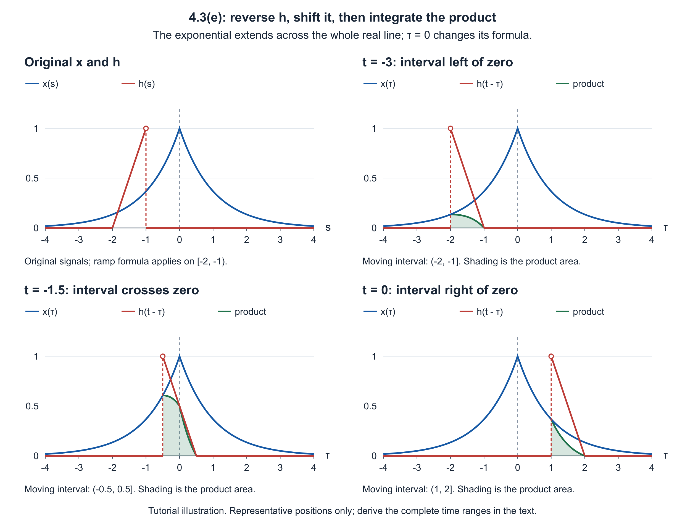
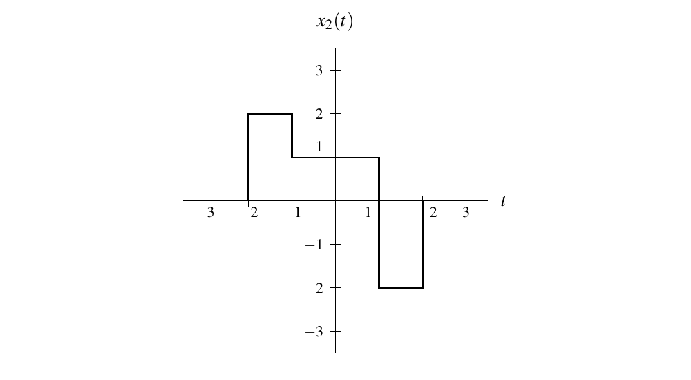

# ECE265 Tutorial 4

## Assignment 3A: Convolution and LTI Systems

T02 · Ruilin Wang

This file contains a recap, worked regular examples, and the MATLAB task statements with ideas and pseudocode for Assignment 3A.

For the lecture overview, see [Lecture Summary 3](../lecture_summery/week3lecture_summary.md), §§2-3 and 6-7, and [Lecture Summary 4](../lecture_summery/tutorial4lecture_summary.md), §§1-4. References below use **printed** slide and textbook pages. The sources for this tutorial are Edition **7.0.0-beta.3**.

### Practice examples

| Method | Selected example |
| --- | --- |
| CT graphical convolution with signed rectangles | 4.1(c) |
| CT graphical convolution with an exponential and a ramp | 4.3(e) (in class) |
| Rewriting an integral as convolution | 4.5 (adapted; self-study) |
| Finding a new response from a known LTI response | 4.9 (in class; original assigned problem) |
| DT convolution with a unit-step sequence | 9.1(b) (in class) |
| Finite DT convolution using a table | 9.3(d) (in class) |
| MATLAB finite-sequence convolution | 9.203(a), (b) |

The regular examples are unassigned textbook parts except 4.9 (the original assigned problem) and 4.5 (adapted from an assigned problem).

## 1. Convolution: fix the output time/index first

The definitions are

$$
(x\ast h)(t)=\int_{-\infty}^{\infty}x(\tau)h(t-\tau)\thinspace d\tau
$$

in CT, and

$$
(x\ast h)(n)=\sum_{k=-\infty}^{\infty}x(k)h(n-k)
$$

in DT. Keep the output time $t$ or index $n$ **fixed** while integrating over $\tau$ or summing over $k$. The latter variables disappear after the calculation.

**Method:** keep $x$ fixed; reverse $h$ first, then shift the reversed signal to form $h(t-\tau)$ or $h(n-k)$. Find where both factors can be nonzero, multiply there, then integrate or sum. Use the formulas where the integral or sum exists.

**Trap:** convolution is not pointwise multiplication. Also, $h(t-\tau)$ is generally not $h(\tau-t)$. If the problem requires computing $x\ast h$ directly without swapping operands, preserve that order.

**References:** slides pp. 126-128; textbook §4.2, pp. 83-84, and §9.2, pp. 399-400.

## 2. CT graphical convolution: overlap and formula changes

If $x$ is zero outside $[A_x,B_x]$ and $h$ is zero outside $[A_h,B_h]$, then the shifted factor $h(t-\tau)$ can be nonzero only for

$$
t-B_h\le\tau\le t-A_h.
$$

Intersect this interval with $A_x\le\tau\le B_x$. The possible integration limits are

$$
L(t)=\max(A_x,t-B_h),\qquad U(t)=\min(B_x,t-A_h).
$$

For ordinary bounded piecewise signals, $L(t)\ge U(t)$ gives zero integral. Otherwise, integrate on the overlap, splitting it wherever either factor changes formula or sign. This finite-interval test does not apply to an operand that extends over the whole real line.

**Method:** mark all endpoints and internal breakpoints on the original graphs. A breakpoint $a$ of $x$ and a breakpoint $b$ of $h$ align when $t=a+b$; use these candidate times to organize the output cases. For each case, sketch the overlap and write the actual product before integrating.

For constant pieces, each contribution is **product of heights × overlap length**, with its sign retained. For ramps, multiply the formulas and integrate the resulting polynomial; overlap length alone is not enough.

**Trap:** support endpoints are not the only breakpoints. A triangular peak, a sign change, or a change in slope can require another integral. Positive and negative contributions may cancel even when the signals overlap. A single touching point contributes zero for the ordinary CT signals here, unlike one overlapping DT sample.

**References:** slide p. 127; textbook §4.2, pp. 83-91. Practice: 4.1(c); the assigned 4.1(e) additionally requires ramp-product integration.

### CT exponential × ramp: split the absolute value before integrating

For a positive real constant $\alpha$,

$$
e^{-\alpha|\tau|}=
\begin{cases}
e^{\alpha\tau},&\tau\lt0\cr
e^{-\alpha\tau},&\tau\ge0.
\end{cases}
$$

First find the interval selected by the finite ramp. If that interval crosses $\tau=0$, split the integral there. Zero is a **formula-change point**, not a support endpoint of this exponential: the exponential is nonzero on both sides.

For a nonzero real constant $c$, useful antiderivatives are

$$
\int e^{c\tau}\thinspace d\tau=\frac{e^{c\tau}}{c}+C,
\qquad
\int\tau e^{c\tau}\thinspace d\tau
=e^{c\tau}\left(\frac{\tau}{c}-\frac{1}{c^2}\right)+C.
$$

For an exponential multiplied by a linear expression in $\tau$, distribute that expression and apply these formulas. Treat $t$ as a constant during integration; then substitute both limits into each antiderivative.

**Trap:** do not use one exponential formula on an interval that crosses zero, or infer zero output just because the finite ramp is far from the origin.

**References:** textbook §4.2 for the graphical procedure; Appendix E.4, p. 734, formula (E.1) and integration by parts. Practice: 4.3(e).

## 3. DT step-weighted convolution: inequalities become sum limits

The DT convention is $u(k)=1$ for $k\ge0$, including zero. Therefore,

$$
u(n-k)=1\quad\Longleftrightarrow\quad k\le n,
$$

and convolution with a unit step is a running sum:

$$
(x\ast u)(n)=\sum_{k=-\infty}^{n}x(k).
$$

**Method:** convert each step factor into an inequality in $k$, intersect those inequalities with the input's support, then split the output ranges where the sum limits or summand change. Include every integer boundary sample.

For integers $A\lt B$, the window $u(k-A)-u(k-B)$ equals 1 for $A\le k\le B-1$ and zero elsewhere. A sum from integer $L$ through integer $U$ contains $U-L+1$ terms when $L\le U$; when $L>U$, it is empty and equals zero.

**Trap:** a left-infinite input can overlap the shifted step even at arbitrarily negative output indices. Do not invent an initial zero-output region by copying the two-finite-sequence picture.

**References:** slide p. 128; textbook §§8.4.4-8.4.5, pp. 372-373; §9.2, especially Example 9.2, pp. 403-404; ideal accumulator in Example 9.9, p. 415. Practice: 9.1(b).

### Sum tools: finite windows and infinite geometric tails

Here $q$ denotes the geometric ratio and $r$ is a summation index. Appendix E.5 uses $r$ for the ratio; the different letters do not change the formulas.

For integers $L\le U$,

$$
\sum_{k=L}^{U}k=\frac{(L+U)(U-L+1)}{2}.
$$

For a positive integer $M$ and $q\ne1$,

$$
\sum_{r=0}^{M-1}q^r=\frac{1-q^M}{1-q}.
$$

For an infinite sum,

$$
\sum_{r=0}^{\infty}q^r=\frac{1}{1-q}\qquad\text{only when }|q|\lt1.
$$

To handle a left-infinite sum $\sum_{k=-\infty}^{K}q^k$ with real $q>1$ and integer $K$, set $r=K-k$. Then $k=K$ gives $r=0$, and $k\to-\infty$ gives $r\to\infty$:

$$
\sum_{k=-\infty}^{K}q^k=q^K\sum_{r=0}^{\infty}(q^{-1})^r.
$$

Now the geometric ratio is $q^{-1}<1$, so the convergent infinite-series formula applies. Changing the index means changing the summand **and both limits**.

The arithmetic-sum formula supports finite ramp inputs in assigned 9.1(a); selected 9.1(b) instead practises an infinite geometric tail. One does not replace the other method.

**References:** textbook Appendix E.5, pp. 734-735, formulas (E.8), (E.9), and (E.11).

## 4. Finite DT convolution: a table with actual sequence indices

If the sequences are zero outside the inclusive integer intervals $[A_x,B_x]$ and $[A_h,B_h]$, the terms that can contribute satisfy

$$
\max(A_x,n-B_h)\le k\le\min(B_x,n-A_h).
$$

The output is zero outside

$$
A_x+A_h\le n\le B_x+B_h.
$$

**Method:** label table columns with $k$, place $x(k)$ and the reversed sequence $h(-k)$ at their correct indices, and make a row for each shift $h(n-k)$. Multiply aligned entries by $x(k)$ and sum the products to obtain $y(n)$. Retain negative values and zero samples in their original positions.

For stored input lengths $L_x=B_x-A_x+1$ and $L_h=B_h-A_h+1$, the full output interval has $L_x+L_h-1$ positions. This is not a count of nonzero samples; cancellation can produce zeros inside the interval.

**MATLAB bridge:** the first array position stores $x(A_x)$, not necessarily $x(0)$. The first full-convolution output position represents $n=A_x+A_h$, and subsequent positions increase $n$ by one. MATLAB array positions start at 1; the stored sequence interval can start at any integer: negative, zero, or positive.

**Trap:** reversing the list of values without reflecting its indices gives the wrong $h(-k)$. A list of output values without its index range is incomplete. Full convolution is not elementwise multiplication or a cropped output.

**References:** slide p. 128; textbook §9.2, Examples 9.4-9.5 and Tables 9.1-9.2, pp. 406-408. Practice: 9.3(d); MATLAB 9.203(a), (b), p. 438.

## 5. Recognize convolution by changing the integration variable

When an integral is to be written using a known $y=x\ast h$, compare it with

$$
y(s)=\int_{-\infty}^{\infty}x(\lambda)h(s-\lambda)\thinspace d\lambda.
$$

The output argument $s$ must not depend on $\lambda$. Renaming an integration variable is harmless; changing its value requires a substitution throughout the integral.

**Method:** choose a new variable, solve for the old one, substitute into **both** function arguments, change the differential, and transform both limits. Only then compare the result with the definition above. For a substitution $\lambda=c\tau+d$ with real $c\ne0$, $d\tau=d\lambda/c$; if $c<0$, the lower and upper limits exchange order. Correctly restoring increasing limits accounts for the sign.

**Trap:** matching only one factor is insufficient. The other must have the form $h(s-\lambda)$, not $h(s+\lambda)$. A reflected input is generally a different function; do not silently replace it with the original $x$.

**References:** slide p. 126; textbook §4.2, p. 83, and the change-of-variable proof of Theorem 4.1 in §4.3, pp. 91 and 93.

## 6. LTI: transfer a known input decomposition to its response

Suppose $H$ is LTI and $Hx_1=y_1$. For a finite combination of shifted copies of the known input, with constant coefficients $c_r$ and real shifts $t_r$,

$$
x_2(t)=\sum_{r=1}^{R}c_r x_1(t-t_r),
$$

linearity and time invariance give

$$
y_2(t)=\sum_{r=1}^{R}c_r y_1(t-t_r).
$$

**Method:** inspect the width, location, height and sign of each piece of the new input. Rebuild it from shifted copies of the given $x_1$, verify that they add to the complete input, then apply exactly the same coefficients and shifts to $y_1$. A wider piece may require several adjacent copies, rather than time stretching.

**Trap:** time invariance guarantees matching **shifts**, not arbitrary time scaling. The known response $y_1$ is not the impulse response unless the given input is an impulse. This method does not require finding the unknown impulse response first.

**References:** slides pp. 116-120 and 132; textbook §§3.8.5-3.8.6 and §4.5; Lecture Summary 4, §4. Practice: original assigned 4.9.

## 4.1(c): Problem

Using the graphical method, for each pair of functions $x$ and $h$ given in the figures below, directly compute $x\ast h$.
(Do not compute $x\ast h$ indirectly by instead computing $h\ast x$ and using the commutative property of convolution.)

**(c)**



Source: textbook §4.11.1, printed p. 114. Only the selected subpart is reproduced above. This example is prepared for self-study or as a backup.

### Knowledge points

- CT convolution and the graphical procedure: slides pp. 126-127; textbook §4.2, pp. 83-91.
- Reading positive and negative constant pieces; finding overlap intervals; retaining signs when adding their areas.
- Connection to Assignment 3A: this example practises signed overlap, but assigned 4.1(e) also requires splitting at a triangular peak and integrating products of ramps. Overlap length alone is insufficient for that assigned question.

### Core bridge formula

For a fixed output time $t$,

$$
(x\ast h)(t)=\int_{-\infty}^{\infty}x(\tau)h(t-\tau)\thinspace d\tau.
$$

Keep $x(\tau)$ fixed, reverse $h$ to obtain $h(-\tau)$, and shift the reversed graph by $t$ to obtain $h(t-\tau)$. Integrate the product only where the graphs overlap.

When two constant pieces of heights $A$ and $B$ overlap from $L$ to $U$, their contribution is

$$
\int_L^U AB\thinspace d\tau=AB(U-L),\qquad U\ge L.
$$

For several positive and negative pieces, compute and add their contributions separately.

### Answer

**1. Read the original graphs.**

The graph of $x$ has height 2 between 0 and 1. The graph of $h$ has height $-1$ between $-1$ and 0, and height $+1$ between 0 and 1:

$$
x(t)=
\begin{cases}
2,&0\le t\lt1\cr
0,&\text{otherwise},
\end{cases}
\qquad
h(t)=
\begin{cases}
-1,&-1\le t\lt0\cr
1,&0\le t\lt1\cr
0,&\text{otherwise}.
\end{cases}
$$

These half-open intervals are a convenient endpoint convention. Changing a value at a single endpoint does not change the convolution integral for the ordinary bounded signals here.

Write $y(t)=(x\ast h)(t)$. We will keep $x(\tau)$ fixed and move $h(t-\tau)$, as the question requires; we will not swap the operands.

**2. Reverse and shift the graph of $h$.**

After reflection about zero, the positive rectangle of $h(-\tau)$ is on the left of zero and the negative rectangle is on the right:

$$
h(-\tau)=
\begin{cases}
1,&-1\lt\tau\le0\cr
-1,&0\lt\tau\le1\cr
0,&\text{otherwise}.
\end{cases}
$$

Shifting this reversed graph by $t$ moves its three edges from $-1,0,1$ to $t-1,t,t+1$:

$$
h(t-\tau)=
\begin{cases}
1,&t-1\lt\tau\le t\cr
-1,&t\lt\tau\le t+1\cr
0,&\text{otherwise}.
\end{cases}
$$

For example, the positive part follows from

$$
0\le t-\tau\lt1
\quad\Longleftrightarrow\quad
t-1\lt\tau\le t.
$$

The negative part follows from

$$
-1\le t-\tau\lt0
\quad\Longleftrightarrow\quad
t\lt\tau\le t+1.
$$

The fixed graph $x(\tau)$ occupies the interval from 0 to 1. As the moving edges $t-1,t,t+1$ pass these fixed endpoints, the overlap changes at

$$
t=-1,\quad0,\quad1,\quad2.
$$

The overlap picture can be organized as follows; endpoint inclusion does not affect these integrals.

| Output time | Positive part of $h(t-\tau)$ overlapping $x(\tau)$ | Negative part overlapping $x(\tau)$ |
| --- | --- | --- |
| $t\lt-1$ | None | None |
| $-1\le t\lt0$ | None | From $0$ to $t+1$ |
| $0\le t\lt1$ | From $0$ to $t$ | From $t$ to $1$ |
| $1\le t\lt2$ | From $t-1$ to $1$ | None |
| $t\ge2$ | None with positive length | None |

**3. Integrate the signed overlap in each case.**

If $t\lt-1$, the rightmost moving edge satisfies $t+1\lt0$. The moving graph is completely left of the fixed rectangle, so

$$
y(t)=0.
$$

If $-1\le t\lt0$, only the negative rectangle overlaps. Its height is $-1$, the fixed rectangle has height 2, and the overlap runs from 0 to $t+1$:

$$
\begin{aligned}
y(t)
&=\int_0^{t+1}2(-1)\thinspace d\tau\cr
&=-2\int_0^{t+1}1\thinspace d\tau\cr
&=-2\bigl[(t+1)-0\bigr]\cr
&=-2(t+1).
\end{aligned}
$$

If $0\le t\lt1$, both signs overlap. The positive part runs from 0 to $t$, and the negative part runs from $t$ to 1:

$$
\begin{aligned}
y(t)
&=\int_0^t2(1)\thinspace d\tau
 +\int_t^1 2(-1)\thinspace d\tau\cr
&=2(t-0)-2(1-t)\cr
&=2t-2+2t\cr
&=4t-2.
\end{aligned}
$$

If $1\le t\lt2$, only the positive rectangle overlaps. Its left edge is $t-1$, while the fixed rectangle ends at 1:

$$
\begin{aligned}
y(t)
&=\int_{t-1}^{1}2(1)\thinspace d\tau\cr
&=2\bigl[1-(t-1)\bigr]\cr
&=2(2-t)\cr
&=4-2t.
\end{aligned}
$$

If $t\ge2$, the leftmost moving edge satisfies $t-1\ge1$. There is no overlap of positive length, so

$$
y(t)=0.
$$

**Final result, valid for every real $t$:**

$$
\boxed{
(x\ast h)(t)=
\begin{cases}
0,&t\lt-1\cr
-2(t+1),&-1\le t\lt0\cr
4t-2,&0\le t\lt1\cr
4-2t,&1\le t\lt2\cr
0,&t\ge2.
\end{cases}
}
$$

**Boundary and sign checks.** At first contact, $y(-1)=-2(-1+1)=0$. At $t=0$, the fixed rectangle completely overlaps the negative part, giving $y(0)=4(0)-2=-2$. At $t=1$, it completely overlaps the positive part, giving $y(1)=4-2(1)=2$. At last contact, $y(2)=0$. The formulas on either side of each boundary agree. At $t=1/2$, the positive and negative overlap lengths are equal, so $y(1/2)=4(1/2)-2=0$ despite overlap being present.

## 4.3(e): Problem

Using the graphical method, compute $x\ast h$ for each pair of functions $x$ and $h$ given below.

**(e)** $x(t)=e^{-|t|}$ and

$$
h(t)=
\begin{cases}
t+2,&-2\le t\lt-1\cr
0,&\text{otherwise};
\end{cases}
$$

Source: textbook §4.11.1, printed p. 115. The common stem and selected subpart are reproduced above. **In-class example.**

### Knowledge points

- CT convolution and its graphical procedure: slides pp. 126-127; textbook §4.2, pp. 83-91.
- Time reversal and shifting of a finite ramp; support inequalities; splitting an absolute-value expression at zero.
- Integrating an exponential multiplied by a linear expression: textbook Appendix E.4, p. 734, especially formula (E.1) and integration by parts.
- Connection to assigned 4.3(f): the exponential is identical, while the finite ramp occupies a different time interval. The same graphical overlap and absolute-value splitting method applies.

### Core bridge formula

For a fixed $t$,

$$
(x\ast h)(t)=\int_{-\infty}^{\infty}x(\tau)h(t-\tau)\thinspace d\tau.
$$

If $h(s)$ can be nonzero only when $A\le s\lt B$, then

$$
A\le t-\tau\lt B
\quad\Longleftrightarrow\quad
t-B\lt\tau\le t-A.
$$

This identifies the moving integration interval. If it crosses a point where $x(\tau)$ changes formula, split the integral there.

For $\alpha>0$,

$$
e^{-\alpha|\tau|}=
\begin{cases}
e^{\alpha\tau},&\tau\lt0\cr
e^{-\alpha\tau},&\tau\ge0.
\end{cases}
$$

For a nonzero real constant $c$,

$$
\int e^{c\tau}\thinspace d\tau=\frac{e^{c\tau}}{c}+C,
\qquad
\int\tau e^{c\tau}\thinspace d\tau
=e^{c\tau}\left(\frac{\tau}{c}-\frac{1}{c^2}\right)+C.
$$

Treat the output time $t$ as a constant while integrating with respect to $\tau$.

### Answer

**1. Sketch the original functions, then reverse and shift $h$.**

The fixed graph $x(\tau)=e^{-|\tau|}$ rises as $e^\tau$ to its value 1 at zero, then falls as $e^{-\tau}$. It is nonzero on both sides of zero.

The original $h$ is a ramp from height 0 at time $-2$ to limiting height 1 just before time $-1$, and is zero elsewhere. Reflecting it gives a decreasing ramp on the interval from 1 to 2:

$$
h(-\tau)=
\begin{cases}
2-\tau,&1\lt\tau\le2\cr
0,&\text{otherwise}.
\end{cases}
$$

Shifting this reversed graph by $t$ moves its two endpoints to $t+1$ and $t+2$. To check the interval algebraically, substitute $t-\tau$ into the original condition:

$$
-2\le t-\tau\lt-1.
$$

The first inequality gives $\tau\le t+2$; the second gives $\tau>t+1$. On this interval, the ramp formula becomes $(t-\tau)+2$. Therefore,

$$
h(t-\tau)=
\begin{cases}
t+2-\tau,&t+1\lt\tau\le t+2\cr
0,&\text{otherwise}.
\end{cases}
$$

The moving ramp has limiting height 1 at its left edge and height 0 at its right edge. This decreasing slope is important: using $\tau-t+2$ would give the wrong reflected graph.

Write $y(t)=(x\ast h)(t)$. Since the moving ramp is zero outside its interval,

$$
y(t)=\int_{t+1}^{t+2}e^{-|\tau|}(t+2-\tau)\thinspace d\tau.
$$

The finite ramp always overlaps the nonzero exponential. The question is not whether they overlap, but which exponential formula applies on that interval.



The working sketches plot the fixed exponential and the moving ramp against the integration variable $\tau$. Each sketch represents one output-time range; it is not a graph of the output $y(t)$. The exact integration limits are derived above and used below.

**2. Find the three graphical positions relative to zero.**

The right edge reaches zero when $t+2=0$, so $t=-2$. The left edge reaches zero when $t+1=0$, so $t=-1$.

| Output time | Position of moving ramp | Formula for the exponential on the interval |
| --- | --- | --- |
| $t\lt-2$ | Entirely left of zero | $e^\tau$ throughout |
| $-2\le t\lt-1$ | Crosses zero, or touches it at the first boundary | $e^\tau$ to the left, $e^{-\tau}$ to the right |
| $t\ge-1$ | Entirely right of zero, possibly touching it | $e^{-\tau}$ throughout |

In the middle case, one of the split intervals can have zero length at an endpoint. Its integral is then zero.

**3. Prepare the two antiderivatives.**

On the negative side of zero, distribute the linear factor and use the bridge formulas with $c=1$:

$$
\begin{aligned}
\int e^\tau(t+2-\tau)\thinspace d\tau
&=(t+2)\int e^\tau\thinspace d\tau
 -\int\tau e^\tau\thinspace d\tau\cr
&=(t+2)e^\tau-e^\tau(\tau-1)+C\cr
&=e^\tau(t+3-\tau)+C.
\end{aligned}
$$

On the positive side, use $c=-1$. Here $1/c=-1$ and $1/c^2=1$:

$$
\begin{aligned}
\int e^{-\tau}(t+2-\tau)\thinspace d\tau
&=(t+2)\int e^{-\tau}\thinspace d\tau
 -\int\tau e^{-\tau}\thinspace d\tau\cr
&=-(t+2)e^{-\tau}-e^{-\tau}(-\tau-1)+C\cr
&=e^{-\tau}(\tau-t-1)+C.
\end{aligned}
$$

**4. Evaluate the integral in each output-time range.**

For $t\lt-2$, the whole interval is negative, so

$$
\begin{aligned}
y(t)
&=\int_{t+1}^{t+2}e^\tau(t+2-\tau)\thinspace d\tau\cr
&=e^{t+2}\bigl[t+3-(t+2)\bigr]
 -e^{t+1}\bigl[t+3-(t+1)\bigr]\cr
&=e^{t+2}(1)-e^{t+1}(2)\cr
&=e^{t+2}-2e^{t+1}\cr
&=(e-2)e^{t+1}.
\end{aligned}
$$

For $-2\le t\lt-1$, split at zero:

$$
y(t)
=\int_{t+1}^{0}e^\tau(t+2-\tau)\thinspace d\tau
 +\int_{0}^{t+2}e^{-\tau}(t+2-\tau)\thinspace d\tau.
$$

For the first integral, substitute the upper limit 0 and lower limit $t+1$ into the negative-side antiderivative:

$$
\begin{aligned}
\int_{t+1}^{0}e^\tau(t+2-\tau)\thinspace d\tau
&=e^0(t+3-0)
 -e^{t+1}\bigl[t+3-(t+1)\bigr]\cr
&=t+3-2e^{t+1}.
\end{aligned}
$$

For the second integral, substitute the upper limit $t+2$ and lower limit 0 into the positive-side antiderivative:

$$
\begin{aligned}
\int_{0}^{t+2}e^{-\tau}(t+2-\tau)\thinspace d\tau
&=e^{-(t+2)}\bigl[(t+2)-t-1\bigr]
 -e^0(0-t-1)\cr
&=e^{-t-2}-(-t-1)\cr
&=e^{-t-2}+t+1.
\end{aligned}
$$

Add the two contributions:

$$
\begin{aligned}
y(t)
&=t+3-2e^{t+1}+e^{-t-2}+t+1\cr
&=2t+4-2e^{t+1}+e^{-t-2}.
\end{aligned}
$$

For $t\ge-1$, the whole interval is nonnegative, so

$$
\begin{aligned}
y(t)
&=\int_{t+1}^{t+2}e^{-\tau}(t+2-\tau)\thinspace d\tau\cr
&=e^{-(t+2)}\bigl[(t+2)-t-1\bigr]
 -e^{-(t+1)}\bigl[(t+1)-t-1\bigr]\cr
&=e^{-t-2}(1)-e^{-t-1}(0)\cr
&=e^{-t-2}.
\end{aligned}
$$

**Final result, valid for every real $t$:**

$$
\boxed{
(x\ast h)(t)=
\begin{cases}
(e-2)e^{t+1},&t\lt-2\cr
2t+4-2e^{t+1}+e^{-t-2},&-2\le t\lt-1\cr
e^{-t-2},&t\ge-1.
\end{cases}
}
$$

**Check the two boundary points.** At $t=-2$, the middle expression gives

$$
2(-2)+4-2e^{-2+1}+e^{-(-2)-2}
=0-2e^{-1}+1
=1-\frac{2}{e}.
$$

The left expression has the same value there:

$$
(e-2)e^{-2+1}=\frac{e-2}{e}=1-\frac{2}{e}.
$$

At $t=-1$, the middle expression approaches

$$
2(-1)+4-2e^{-1+1}+e^{-(-1)-2}
=2-2+e^{-1}
=\frac{1}{e},
$$

which agrees with the last expression $e^{-(-1)-2}=1/e$. Thus the three pieces fit at both transition times. Neither tail is identically zero: the exponential has nonzero values at every finite input time.

## 4.5: Problem (adapted)

**Adapted from textbook Exercise 4.5, printed p. 116.** The original integrand is $x(-\tau-b)h(\tau+at)$. In this tutorial version, it is changed to $x(\tau+b)h(at-\tau)$: both function arguments have been changed. The given relation $y=x\ast h$, the real constants $a,b$, the integration limits and the requested task are unchanged. This is not a verbatim reproduction of the original exercise.

Let $x$, $y$, $h$, and $v$ be functions such that $y=x\ast h$ and

$$
v(t)=\int_{-\infty}^{\infty}x(\tau+b)h(at-\tau)\thinspace d\tau,
$$

where $a$ and $b$ are real constants. Express $v$ in terms of $y$.

This adapted example is for self-study or backup, not one of the four scheduled classroom examples.

### Knowledge points

- CT convolution definition: slide p. 126; textbook §4.2, p. 83.
- A change of integration variable must change both arguments, the differential and the limits: textbook §4.3, proof of Theorem 4.1, pp. 91 and 93.
- Recap §5: compare the entire rewritten integral with the standard convolution definition.

### Core bridge formula

For any output argument $s$ where the convolution exists,

$$
y(s)=(x\ast h)(s)
=\int_{-\infty}^{\infty}x(\lambda)h(s-\lambda)\thinspace d\lambda.
$$

The integration variable $\lambda$ is not the output argument $s$. To identify a given integral with $y(s)$, obtain $x(\lambda)$ in the first factor and $h(s-\lambda)$ in the second, with $s$ independent of $\lambda$.

### Answer

**1. Choose a new variable for the first function argument.**

Since the first factor is $x(\tau+b)$, set

$$
\lambda=\tau+b,
\qquad \tau=\lambda-b,
\qquad d\tau=d\lambda.
$$

Because $b$ is a fixed real constant, $\tau\to-\infty$ gives $\lambda\to-\infty$, and $\tau\to\infty$ gives $\lambda\to\infty$. The limits keep their order; this substitution is a translation, not a reflection or scaling.

**2. Substitute into both factors.**

For the first factor,

$$
x(\tau+b)=x((\lambda-b)+b)=x(\lambda).
$$

For the second factor,

$$
h(at-\tau)
=h(at-(\lambda-b))
=h(at-\lambda+b)
=h((at+b)-\lambda).
$$

Therefore the whole integral becomes

$$
v(t)=\int_{-\infty}^{\infty}x(\lambda)h((at+b)-\lambda)\thinspace d\lambda.
$$

**3. Match the output argument.**

Comparing with the bridge formula, the first factor is $x(\lambda)$, the second is $h(s-\lambda)$, and

$$
s=at+b.
$$

Thus the requested expression is

$$
\boxed{v(t)=y(at+b).}
$$

No factor $1/|a|$ appears: $a$ multiplies the output time $t$, not the integration variable being changed. We never divide by $a$, so the result also covers $a=0$, when $v(t)=y(b)$, provided that value exists.

## 4.9: Problem

Consider a LTI system whose response to the function $x_1(t)=u(t)-u(t-1)$ is the function $y_1$. Determine the response $y_2$ of the system to the input $x_2$ shown in the figure below in terms of $y_1$.



Source: Michael D. Adams, *Signals and Systems*, Edition 7.0.0-beta.3, Exercise 4.9, printed p. 116. **In-class example. This is the original assigned problem, not an unassigned substitute.**

### Knowledge points

- Time invariance transfers an input shift to the same output shift: slides pp. 116-117; textbook §3.8.5.
- Linearity transfers constant coefficients and addition: slides pp. 118-120; textbook §3.8.6.
- LTI input-output interpretation: slide p. 132; textbook §4.5. Here we use a known response directly, without finding the impulse response.
- Recap §6 and Lecture Summary 4, §4, Supplement on input decomposition.

### Core bridge formula

If $Hx_1=y_1$ for an LTI system and

$$
x_2(t)=\sum_{r=1}^{R}c_r x_1(t-t_r),
$$

then

$$
y_2(t)=\sum_{r=1}^{R}c_r y_1(t-t_r).
$$

First express the entire new input using copies of the given input. Then transfer exactly those coefficients and shifts to the known output. This rule allows shifts and amplitude changes, not arbitrary time stretching.

### Answer

**1. Identify the building block.**

Using the course convention $u(0)=1$,

$$
x_1(t)=u(t)-u(t-1)
=\begin{cases}
1,&0\le t\lt1\cr
0,&\text{otherwise}.
\end{cases}
$$

It is a rectangle of height 1 and width 1. Its shifted copy $x_1(t-t_0)$ equals 1 when

$$
0\le t-t_0\lt1
\quad\Longleftrightarrow\quad
t_0\le t\lt t_0+1.
$$

**2. Read and rebuild the new input.**

Using left-closed, right-open intervals consistently with the step convention, the graph has height 2 on $[-2,-1)$, height 1 on $[-1,1)$, and height $-2$ on $[1,2)$; it is zero elsewhere.

The middle piece is two units wide, so divide it into the adjacent unit intervals $[-1,0)$ and $[0,1)$. Each now matches one copy of $x_1$.

| Interval | Required height | Shifted copy | Coefficient |
| --- | --- | --- | --- |
| $-2\le t\lt-1$ | 2 | $x_1(t+2)$, with $t_0=-2$ | 2 |
| $-1\le t\lt0$ | 1 | $x_1(t+1)$, with $t_0=-1$ | 1 |
| $0\le t\lt1$ | 1 | $x_1(t)$, with $t_0=0$ | 1 |
| $1\le t\lt2$ | -2 | $x_1(t-1)$, with $t_0=1$ | -2 |

The support conditions for the four copies are

$$
\begin{aligned}
0\le t+2\lt1&\quad\Longleftrightarrow\quad-2\le t\lt-1\cr
0\le t+1\lt1&\quad\Longleftrightarrow\quad-1\le t\lt0\cr
0\le t\lt1&\quad\Longleftrightarrow\quad0\le t\lt1\cr
0\le t-1\lt1&\quad\Longleftrightarrow\quad1\le t\lt2.
\end{aligned}
$$

Multiplying the first copy by 2 gives its required height, the next two already have height 1, and multiplying the last by $-2$ gives the negative piece. Hence

$$
x_2(t)=2x_1(t+2)+x_1(t+1)+x_1(t)-2x_1(t-1).
$$

This also reconstructs the graph at the jumps under the stated convention: the left copy ends when the next begins, so there is no double counting. Outside $[-2,2)$ all four copies vanish.

**3. Apply time invariance and linearity.**

The same system maps each shifted input to the same shift of $y_1$:

| Input to $H$ | Corresponding output |
| --- | --- |
| $x_1(t+2)$ | $y_1(t+2)$ |
| $x_1(t+1)$ | $y_1(t+1)$ |
| $x_1(t)$ | $y_1(t)$ |
| $x_1(t-1)$ | $y_1(t-1)$ |

Linearity then keeps the four coefficients $2,1,1,-2$ unchanged when adding these responses. Therefore,

$$
\boxed{y_2(t)=2y_1(t+2)+y_1(t+1)+y_1(t)-2y_1(t-1).}
$$

The middle width-2 rectangle was built from two adjacent width-1 copies; we did not assume that stretching $x_1$ would stretch its output. Also, $y_1$ is the response to a rectangle, not the impulse response.

## 9.1(b): Problem

**Textbook:** §9.11.1, printed p. 432, Edition 7.0.0-beta.3.

Compute $x\ast h$ for each pair of sequences $x$ and $h$ given below.

(b) $x(n)=2^n u(-n)$ and $h(n)=u(n)$;

**In-class example.**

### Knowledge points

- Practical DT convolution: slides p. 128; textbook §9.2, pp. 399-400.
- Unit-step inequalities, including the value at zero: textbook §8.4.4, p. 372.
- Convolution with a unit step as a running sum: textbook Example 9.9, p. 415. Example 9.2, pp. 403-404, also illustrates an infinite sum whose upper limit moves with the output index.
- Infinite geometric sums: Appendix E.5, p. 735, formula (E.11).
- Tutorial recap §3; Lecture Summary 4, §1.

### Core bridge formula

Start from the definition:

$$
(x\ast h)(n)=\sum_{k=-\infty}^{\infty}x(k)h(n-k).
$$

If $h=u$, then $u(n-k)=1$ exactly when $k\le n$, so

$$
(x\ast u)(n)=\sum_{k=-\infty}^{n}x(k).
$$

For an infinite geometric sum, use

$$
\sum_{r=0}^{\infty}q^r=\frac{1}{1-q}\qquad\text{when }|q|\lt1.
$$

If the sum extends to negative infinity, change its index and both limits before applying this formula. The ratio of the rewritten series, not just the original exponential base, must satisfy the convergence condition.

### Answer

**1. Substitute the two sequences into convolution.**

For a fixed integer $n$,

$$
y(n)=(x\ast h)(n)
=\sum_{k=-\infty}^{\infty}2^k u(-k)u(n-k).
$$

The first step factor requires

$$
u(-k)=1\quad\Longleftrightarrow\quad-k\ge0
\quad\Longleftrightarrow\quad k\le0.
$$

The second step factor requires

$$
u(n-k)=1\quad\Longleftrightarrow\quad n-k\ge0
\quad\Longleftrightarrow\quad k\le n.
$$

Thus both factors equal 1 for $k\le\min(0,n)$, and

$$
y(n)=\sum_{k=-\infty}^{\min(0,n)}2^k.
$$

These are two left-infinite intervals, so they overlap for every integer $n$. There is no initial range in which the output must be zero. The upper limit changes form at $n=0$.

**2. Case 1: $n\le0$.**

Here, $\min(0,n)=n$, so

$$
y(n)=\sum_{k=-\infty}^{n}2^k.
$$

To put the sum into the geometric-series formula, set $r=n-k$, so $k=n-r$.

- At $k=n$, the new index is $r=n-n=0$.
- As $k\to-\infty$, the new index satisfies $r\to\infty$.
- The summand becomes $2^k=2^{n-r}=2^n(1/2)^r$.

Listing the terms from the upper limit backwards gives

$$
y(n)=2^n+2^{n-1}+2^{n-2}+\cdots
=2^n\sum_{r=0}^{\infty}\left(\frac12\right)^r.
$$

The ratio is $q=1/2$, and $|1/2|\lt1$. Substitute it into the geometric formula:

$$
y(n)=2^n\frac{1}{1-1/2}
=2^n\frac{1}{1/2}
=2^n(2)
=2^{n+1},\qquad n\le0.
$$

**3. Case 2: $n>0$.**

Since the indices are integers, this case is $n\ge1$. Now $\min(0,n)=0$, so

$$
y(n)=\sum_{k=-\infty}^{0}2^k.
$$

Set $r=-k$, so $k=-r$. At $k=0$, $r=0$; as $k\to-\infty$, $r\to\infty$. The summand is $2^{-r}=(1/2)^r$. Therefore,

$$
y(n)=\sum_{r=0}^{\infty}\left(\frac12\right)^r
=\frac{1}{1-1/2}
=\frac{1}{1/2}
=2,\qquad n\ge1.
$$

The running sum has already included every nonzero input sample at $n=0$. Increasing $n$ beyond zero only adds input samples that equal zero, so the output stays at 2.

**Final answer, for every integer $n$:**

$$
\boxed{
(x\ast h)(n)=
\begin{cases}
2^{n+1},&n\le0\cr
2,&n\ge1.
\end{cases}
}
$$

**Boundary check:** the input includes $x(0)=2^0u(0)=1$. At $n=0$,

$$
y(0)=1+\frac12+\frac14+\cdots=2=2^{0+1}.
$$

At the next index, $x(1)=2^1u(-1)=2(0)=0$, so

$$
y(1)=y(0)+x(1)=2+0=2.
$$

The boundary sample is included exactly once, and both output cases agree with the running-sum interpretation.

### Boundary clarification: finite-window running sums (9.1(a))

In assigned 9.1(a), $x(n)=n[u(n+2)-u(n-5)]$ and $h(n)=u(n)$. This note addresses the case boundary, not the full solution.

With the DT convention $u(0)=1$, the window includes $-2\le k\le4$: $x(4)=4$, but $x(5)=0$. Since convolution with $u$ accumulates samples with $k\le n$, the sum has upper limit $\min(n,4)$ when $n\ge-2$. Before $n=-2$, no window samples have entered the running sum. See recap §3 for the window and sum rules.

At $n=4$, the moving upper limit $n$ and the fixed upper limit $4$ coincide. All window samples have already been included:

$$
\left.\sum_{k=-2}^{n}k\right|_{n=4}
=\sum_{k=-2}^{4}k
=-2-1+0+1+2+3+4=7.
$$

Thus either of these **final-formula interval conventions** is valid:

- Growing-sum branch: $-2\le n\lt4$; constant branch: $n\ge4$.
- Growing-sum branch: $-2\le n\le4$; constant branch: $n\ge5$.

The growing-sum formula is still valid at $n=4$, even though the overlap is already complete there. Including $n=4$ in both branches is numerically consistent if both give the same value, but non-overlapping intervals make the final answer clearer. The branches are alternatives, not two quantities to add together.

## 9.3(d): Problem

**Textbook:** §9.11.1, printed p. 432, Edition 7.0.0-beta.3.

For each pair of sequences $x$ and $h$ given below, compute $y=x\ast h$ using the tabular approach. Assume that any sequence values not explicitly specified are zero.

(d) $(x_0,x_1,\ldots,x_3)=(4,3,2,1)$ and $(h_{-2},h_{-1},\ldots,h_1)=(-1,1,-1,1)$.

**In-class example.**

### Knowledge points

- Practical DT convolution: slides p. 128; textbook §9.2, pp. 399-400.
- Tabular convolution with actual integer indices: textbook Examples 9.4-9.5 and Tables 9.1-9.2, pp. 406-408.
- Finite-duration output bounds: textbook Exercise 9.9, p. 433.
- Tutorial recap §4; Lecture Summary 4, §1, Supplement on finite-sequence index checks.

### Core bridge formula

For each output index $n$,

$$
y(n)=\sum_{k=-\infty}^{\infty}x(k)h(n-k).
$$

A table implements this formula: keep the row of $x(k)$ fixed, reverse $h(k)$ to form $h(-k)$, shift that row by $n$ to form $h(n-k)$, multiply aligned entries and sum.

If $x$ is zero outside the integer interval $[A_x,B_x]$ and $h$ is zero outside $[A_h,B_h]$, the output is zero outside

$$
A_x+A_h\le n\le B_x+B_h.
$$

This gives a possible nonzero range, not a guarantee that every output sample inside it is nonzero.

### Answer

**1. Place the input values at their actual indices.**

The notation $x_0=4$ means $x(0)=4$. The first value of $h$, however, is at index $-2$, not at index 0:

$$
x(0)=4,\quad x(1)=3,\quad x(2)=2,\quad x(3)=1,
$$

$$
h(-2)=-1,\quad h(-1)=1,\quad h(0)=-1,\quad h(1)=1.
$$

All other values are zero. The input intervals are $[0,3]$ and $[-2,1]$, so the possible output indices are

$$
0+(-2)\le n\le3+1,
\qquad\text{or}\qquad -2\le n\le4.
$$

Both input lists have 4 samples. Therefore, the full output interval contains

$$
4+4-1=7
$$

positions: $-2,-1,0,1,2,3,4$.

**2. Reverse $h$ and shift it to build the table.**

Under reversal, each original index changes sign. In particular,

$$
h(-k)=
\begin{cases}
1,&k=-1\cr
-1,&k=0\cr
1,&k=1\cr
-1,&k=2\cr
0,&\text{otherwise}.
\end{cases}
$$

For example, at $k=-1$, we read $h(-(-1))=h(1)=1$; at $k=2$, we read $h(-2)=-1$.

Every column below is an actual integer value of $k$, not an array position. A zero entry means that the sequence value at that index is zero. For each shifted row, multiply its entries by the fixed $x(k)$ row; the sum of those products is shown in the last column.

| Sequence / shift | $k=-3$ | $k=-2$ | $k=-1$ | $k=0$ | $k=1$ | $k=2$ | $k=3$ | $k=4$ | $k=5$ | $k=6$ | Output |
| --- | --- | --- | --- | --- | --- | --- | --- | --- | --- | --- | --- |
| $x(k)$ | 0 | 0 | 0 | 4 | 3 | 2 | 1 | 0 | 0 | 0 | - |
| $h(k)$ | 0 | -1 | 1 | -1 | 1 | 0 | 0 | 0 | 0 | 0 | - |
| $h(-k)$ | 0 | 0 | 1 | -1 | 1 | -1 | 0 | 0 | 0 | 0 | - |
| $n=-2$: $h(-2-k)$ | 1 | -1 | 1 | -1 | 0 | 0 | 0 | 0 | 0 | 0 | $y(-2)=-4$ |
| $n=-1$: $h(-1-k)$ | 0 | 1 | -1 | 1 | -1 | 0 | 0 | 0 | 0 | 0 | $y(-1)=1$ |
| $n=0$: $h(-k)$ | 0 | 0 | 1 | -1 | 1 | -1 | 0 | 0 | 0 | 0 | $y(0)=-3$ |
| $n=1$: $h(1-k)$ | 0 | 0 | 0 | 1 | -1 | 1 | -1 | 0 | 0 | 0 | $y(1)=2$ |
| $n=2$: $h(2-k)$ | 0 | 0 | 0 | 0 | 1 | -1 | 1 | -1 | 0 | 0 | $y(2)=2$ |
| $n=3$: $h(3-k)$ | 0 | 0 | 0 | 0 | 0 | 1 | -1 | 1 | -1 | 0 | $y(3)=1$ |
| $n=4$: $h(4-k)$ | 0 | 0 | 0 | 0 | 0 | 0 | 1 | -1 | 1 | -1 | $y(4)=1$ |

**3. Show the product sum for every output sample.**

Only $k=0,1,2,3$ can contribute because $x(k)=0$ elsewhere. Thus every table row can also be written as

$$
y(n)=4h(n)+3h(n-1)+2h(n-2)+1h(n-3).
$$

Substitute each output index and each actual value of $h$:

For $n=-2$,

$$
\begin{aligned}
y(-2)&=4h(-2)+3h(-3)+2h(-4)+1h(-5)\cr
&=4(-1)+3(0)+2(0)+1(0)\cr
&=-4+0+0+0=-4.
\end{aligned}
$$

For $n=-1$,

$$
\begin{aligned}
y(-1)&=4h(-1)+3h(-2)+2h(-3)+1h(-4)\cr
&=4(1)+3(-1)+2(0)+1(0)\cr
&=4-3+0+0=1.
\end{aligned}
$$

For $n=0$,

$$
\begin{aligned}
y(0)&=4h(0)+3h(-1)+2h(-2)+1h(-3)\cr
&=4(-1)+3(1)+2(-1)+1(0)\cr
&=-4+3-2+0=-3.
\end{aligned}
$$

For $n=1$,

$$
\begin{aligned}
y(1)&=4h(1)+3h(0)+2h(-1)+1h(-2)\cr
&=4(1)+3(-1)+2(1)+1(-1)\cr
&=4-3+2-1=2.
\end{aligned}
$$

For $n=2$,

$$
\begin{aligned}
y(2)&=4h(2)+3h(1)+2h(0)+1h(-1)\cr
&=4(0)+3(1)+2(-1)+1(1)\cr
&=0+3-2+1=2.
\end{aligned}
$$

For $n=3$,

$$
\begin{aligned}
y(3)&=4h(3)+3h(2)+2h(1)+1h(0)\cr
&=4(0)+3(0)+2(1)+1(-1)\cr
&=0+0+2-1=1.
\end{aligned}
$$

For $n=4$,

$$
\begin{aligned}
y(4)&=4h(4)+3h(3)+2h(2)+1h(1)\cr
&=4(0)+3(0)+2(0)+1(1)\cr
&=0+0+0+1=1.
\end{aligned}
$$

For $n\le-3$ or $n\ge5$, the nonzero parts of the two rows do not overlap, so every product is zero and $y(n)=0$.

**Final answer:**

$$
\boxed{(y_{-2},y_{-1},y_0,y_1,y_2,y_3,y_4)=(-4,1,-3,2,2,1,1)}
$$

with

$$
\boxed{y(n)=0\quad\text{for }n\le-3\text{ or }n\ge5.}
$$

The first answer value belongs to index $-2$, not index 0. Keep this starting index when reporting or plotting the result.

## MATLAB 9.203(a), (b): Problem

**Original question:** textbook Exercise 9.203, printed p. 438, Edition 7.0.0-beta.3. The common stem and both assigned subparts are reproduced below.

For each pair of sequences $x$ and $h$ given below, use the MATLAB `conv` function to compute $x\ast h$. Assume that any sequence values not explicitly specified are zero.

(a) $(x_0,x_1,\ldots,x_9)=(1,4,9,16,25,36,49,64,81,100)$ and $(h_0,h_1,\ldots,h_4)=(1,-4,6,-4,1)$; and

(b) $(x_0,x_1,\ldots,x_7)=(1,4,9,10,-10,-9,-4,-1)$ and $(h_0,h_1,h_2)=(1,-2,1)$.

### Knowledge points

- **DT convolution:** slides pp. 126 and 128; textbook §9.2, pp. 399-400.
- **Finite sequences and actual sequence indices:** textbook §9.2, Examples 9.4-9.5 and Tables 9.1-9.2, pp. 406-408; see recap §4 above.
- **MATLAB task and submission requirements:** textbook Exercise 9.203, p. 438; assignment handout §1.3, p. 1.

The exercise supplies numerical sequences, not audio files. It asks for convolution using `conv`; no recording, playback, normalization or user-defined function is required.

### Core bridge formula

The mathematical operation is

$$
y(n)=(x\ast h)(n)=\sum_{k=-\infty}^{\infty}x(k)h(n-k).
$$

For finite sequences, store the supplied sample values in increasing sequence-index order. MATLAB's `conv` computes the full convolution by default; do not replace it with elementwise multiplication or crop the output to an input's length.

If the stored input intervals begin at $A_x$ and $A_h$ and have lengths $L_x$ and $L_h$, then

$$
L_y=L_x+L_h-1,
\qquad
n_{\mathrm{first}}=A_x+A_h,
\qquad
n_{\mathrm{last}}=n_{\mathrm{first}}+L_y-1.
$$

These are the indices of the full stored output interval, not a claim that every output sample is nonzero. The convolution is zero outside that interval.

**Array position is not sequence index.** In both assigned subparts, the first stored input value is the sample at index 0. MATLAB stores that value at array position 1. Similarly, the first stored output value represents $y(0)$, not $y(1)$.

### 9.203(a): Idea and pseudocode

1. Enter the ten given $x$ values in their original order, followed by the five given $h$ values in their original order. Keep every minus sign in $h$.
2. Ask `conv` for the full convolution. There is no need to reverse $h$ manually before calling it: reversal is already part of the mathematical operation that `conv` implements.
3. Determine the output indices separately from its values. Here,

   $$
   L_y=10+5-1=14,
   \qquad n_{\mathrm{first}}=0+0=0,
   \qquad n_{\mathrm{last}}=0+14-1=13.
   $$

4. Display the computed values with the corresponding indices $0,1,\ldots,13$. Check that there are 14 stored values. Keep zero-valued samples in place; do not remove them and shift the later samples' indices.

```text
STORE x_values using the ten samples given in part (a)
STORE h_values using the five samples given in part (a)
COMPUTE y_values using MATLAB's full conv operation
BUILD y_indices from the sum of the input starting indices
    through that starting index plus the output length minus one
DISPLAY each sequence index alongside its computed output value
CHECK that the output length equals the sum of the two input lengths minus one
```

### 9.203(b): Idea and pseudocode

Use the same method with the new data; do not reuse the arrays from part (a).

1. Enter all eight $x$ values, including the four negative entries, and all three $h$ values. Negative samples are amplitudes, not instructions to shift or reverse a sequence.
2. Compute the full convolution with `conv`.
3. Determine the output interval:

   $$
   L_y=8+3-1=10,
   \qquad n_{\mathrm{first}}=0+0=0,
   \qquad n_{\mathrm{last}}=0+10-1=9.
   $$

4. Display the ten computed output samples with indices $0,1,\ldots,9$. Retain all signs and any zeros.

```text
REPLACE x_values with the eight samples given in part (b)
REPLACE h_values with the three samples given in part (b)
COMPUTE y_values using MATLAB's full conv operation
REBUILD y_indices for the new output length
DISPLAY each sequence index alongside its computed output value
CHECK that both arrays came from part (b), not part (a)
CHECK that the output length equals the sum of the two input lengths minus one
```

### Checks and what to include in your submission

- Check the output length and index range before interpreting the numerical result.
- Check the first and last stored output samples by multiplying the corresponding first and last input samples. At each extreme there is only one aligned pair. This tests ordering and indexing without recomputing the whole convolution.
- The exercise does not explicitly request a plot. An optional discrete-time stem plot can help you inspect the result, but its horizontal axis should show the actual sequence indices, not default MATLAB array positions.
- Unless explicitly stated otherwise, assignment handout §1.3 requires a listing of your code and a copy of the MATLAB output/results, such as numerical results or graphs. Do not submit only a claim that `conv` was called.

The pseudocode gives the method; the numerical output vectors and full executable demonstration code are not supplied here.

**Sources:** Michael D. Adams, unified lecture slides and *Signals and Systems*, Edition 7.0.0-beta.3; Assignment handout Version 2026-09-21, Assignment 3, Part A. This recap revisits prerequisite material; it does not expand Lecture Summary 4 beyond slides pp. 128-138 or introduce Assignment 3B solutions.

**Textbook attribution:** Original question text and source figures are from Michael D. Adams, *Signals and Systems*, Edition 7.0.0-beta.3, © 2012-2026 Michael D. Adams, licensed under [CC BY-NC-ND 3.0](https://creativecommons.org/licenses/by-nc-nd/3.0/). Exercise 4.5 is explicitly labelled as a tutorial adaptation. The worked solutions and the convolution working diagram are tutorial content, not reproduced textbook solutions.
